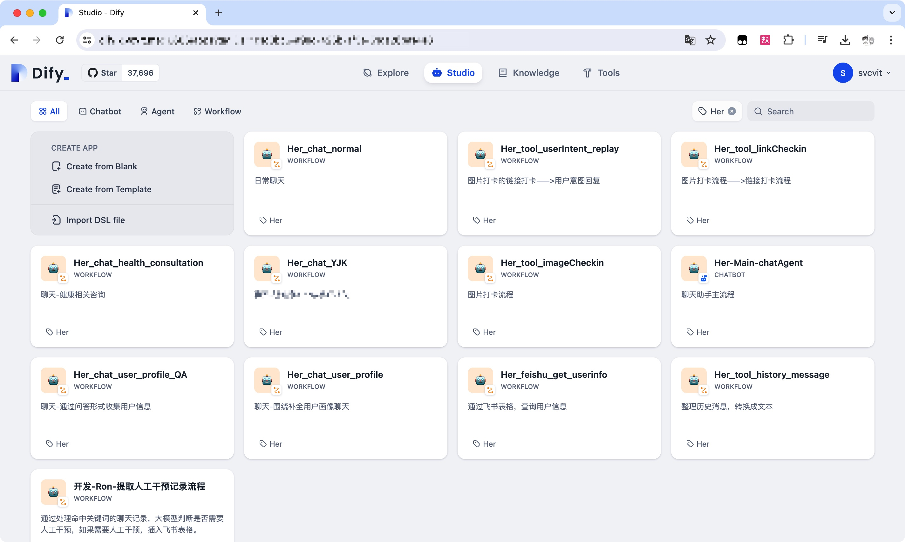

# Awesome-Dify-Workflow
分享一些好用的 Dify 工作流程，方便大家开箱即用，更多 Workflow 收集整理中。

# 目录

## 翻译
- `中译英.yml` 通过宝玉的 Prompt，直译->反思->意译，将中文翻译成高质量的英文。
- `DuckDuckGo翻译+LLM二次翻译.yml` 与三步翻译类似，但是把第一步的直译变成传统翻译引擎翻译，节省 Token，提高翻译效率，同时提高翻译质量。

# 用法
注册 [Dify](https://cloud.dify.ai/) 账号，添加 Deepseek 模型。

复制 Workflow 的 URL，导入 DLS 文件即可。

