# Awesome-Dify-Workflow

分享一些好用的 Dify 工作流程，自用、学习两相宜，请使用 Dify 0.8.0 及以上版本导入。已支持多 **任务并行** 以及 **会话变量** 相关特性。

所有的 Workflow 基本都可以 **免费** 使用，更多 Workflow 收集整理中……

## 分享群
开了一个分享群，有兴趣可以加入，如果你有关于 workflow 的问题也可以一起讨论。（2024/11/12 更新）
- 一号群超 200 了，加群主好友，备注 dify，拉你入群
- 也可以直接扫二号群，目前人少一点

## 模型
如果你希望体验 OpenAI 或 Anthropic 的模型，可以使用这个服务 [CoffBox](https://one.coffbox.com/) 的服务。配置方式参考 [如何在Dify中使用CoffBox的服务](https://blog.vcvit.me/2024/11/13/how-to-use-one-api-in-dify/)

## 参考截图

所有 DSL 都为工作流模式，可以方便的发布为工具后，嵌入 ChatBot 流程。工作流会包含基础的输入、条件判断、变量聚合器、输出等内容。

# DSL 目录

你可以参考下面每个 yml 的描述，找到你需要的 Workflow，然后在 DSL 文件夹中找到对应的文件，复制文件的 URL，导入自己的 Dify 账号即可。

## 2024-11-15更新

| 文件                               | 描述                                                                                                                                                                           | 来源                                                                |
| ---------------------------------- | ------------------------------------------------------------------------------------------------------------------------------------------------------------------------------ | ------------------------------------------------------------------- |
| `json_translate.yml`                       | 解析JSON中的需要翻译的内容，使用迭代器进行翻译，再组合成新的JSON，保持原有JSON的结构 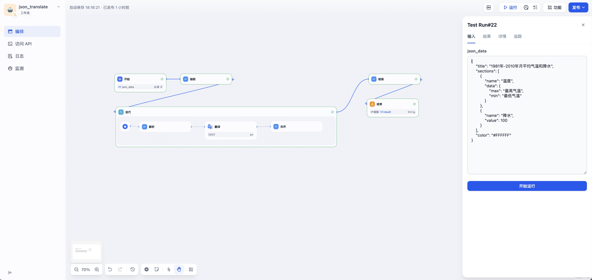                                                      | 微信 @svcvit  |

## 2024-11-14更新

| 文件                               | 描述                                                                                                                                                                           | 来源                                                                |
| ---------------------------------- | ------------------------------------------------------------------------------------------------------------------------------------------------------------------------------ | ------------------------------------------------------------------- |
| `腾讯云SubtitleInfo.yml`                       | 这是一个代码相关的示例，通过腾讯云的授权信息加密，获取需要的内容信息参考。如果你需要使用代码节点，可以参考用法。 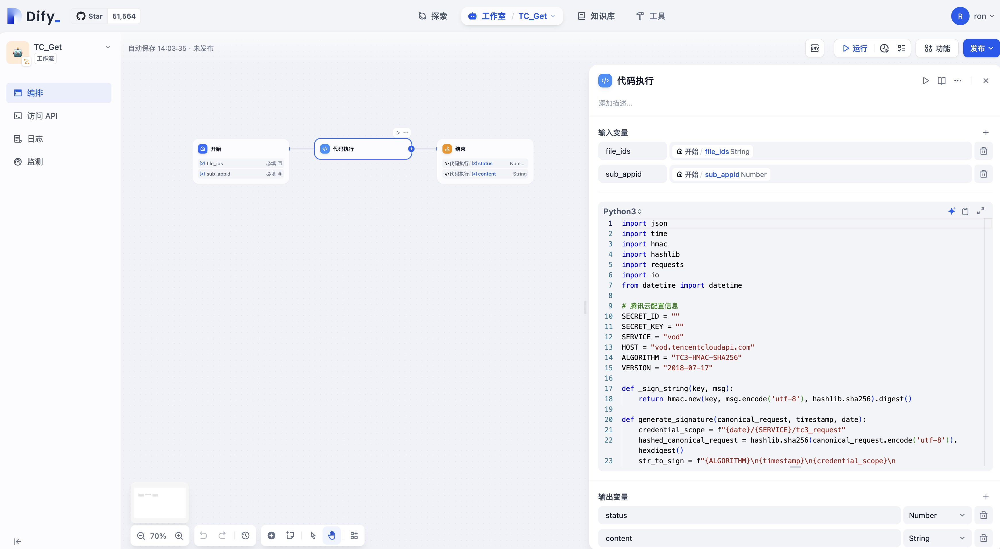                                                      | 微信分享群  |
| `chart_demo.yml`                       | 通过回复内容渲染charts的图表内容。当然你可以可以根据sql查询数据，拼接成需要的内容 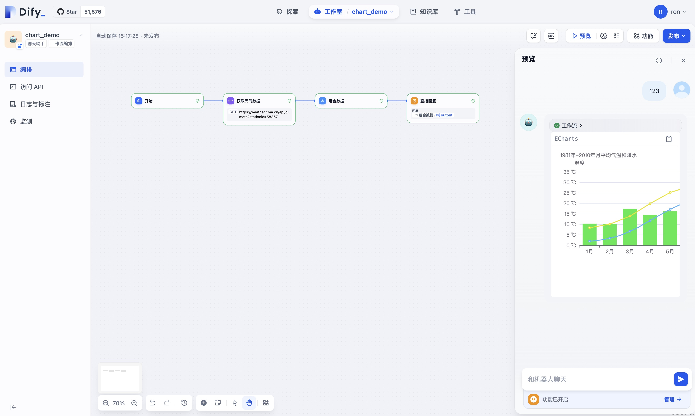                                                      |  微信 @svcvit   |

## 2024-11-12更新

| 文件                               | 描述                                                                                                                                                                           | 来源                                                                |
| ---------------------------------- | ------------------------------------------------------------------------------------------------------------------------------------------------------------------------------ | ------------------------------------------------------------------- |
| `Form表单聊天Demo.yml`                       | 在对话框登录之后有权限访问模型 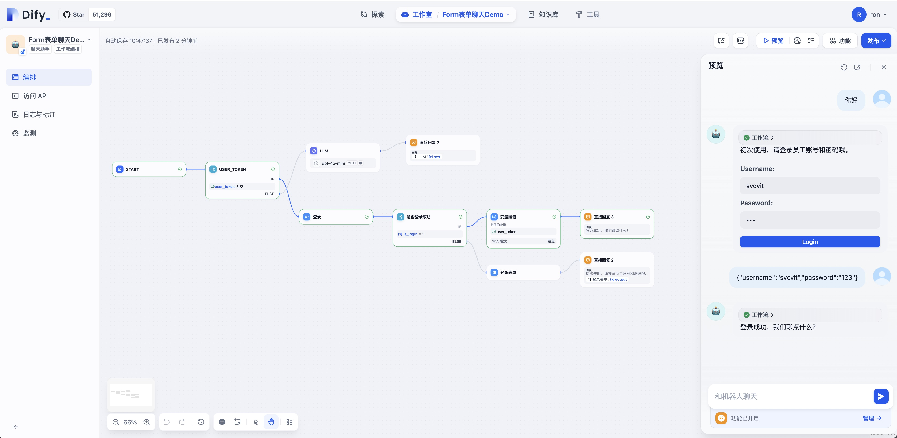                                                      | 微信 @svcvit  |

## 翻译

| 文件                               | 描述                                                                                                                                                                           | 来源                                                                |
| ---------------------------------- | ------------------------------------------------------------------------------------------------------------------------------------------------------------------------------ | ------------------------------------------------------------------- |
| `中译英.yml`                       | 通过宝玉的 Prompt，直译->反思->意译，将中文翻译成高质量的英文。 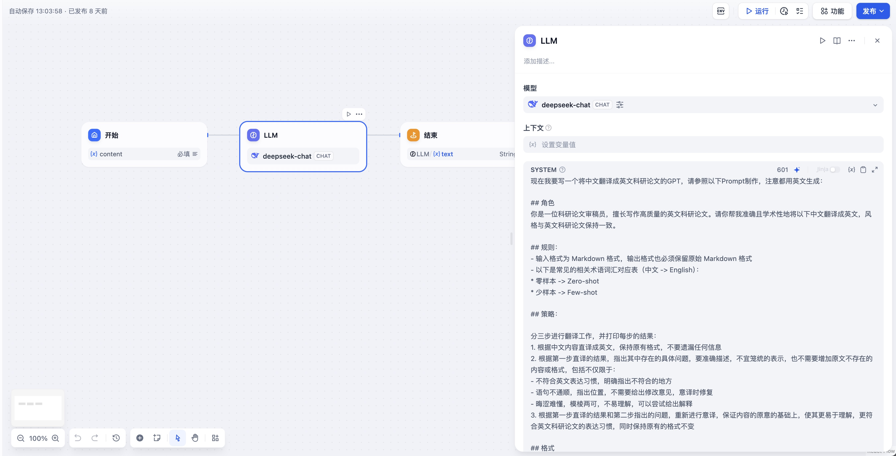                                                      | 暂无                                                                |
| `DuckDuckGo 翻译+LLM 二次翻译.yml` | 与三步翻译类似，但是把第一步的直译变成传统翻译引擎翻译，节省 Token，提高翻译效率，同时提高翻译质量。 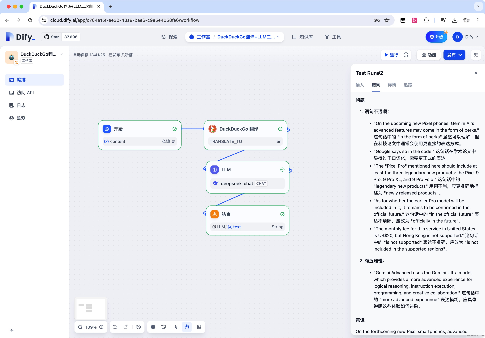                 | 暂无                                                                |
| `translation_workflow.yml`         | 使用吴恩达提出 Agentic Workflow 制作的翻译工具，录入`输入语言`、`目标语言`、`国家`、`原始文本` 4 个参数，提供更细致的翻译结果 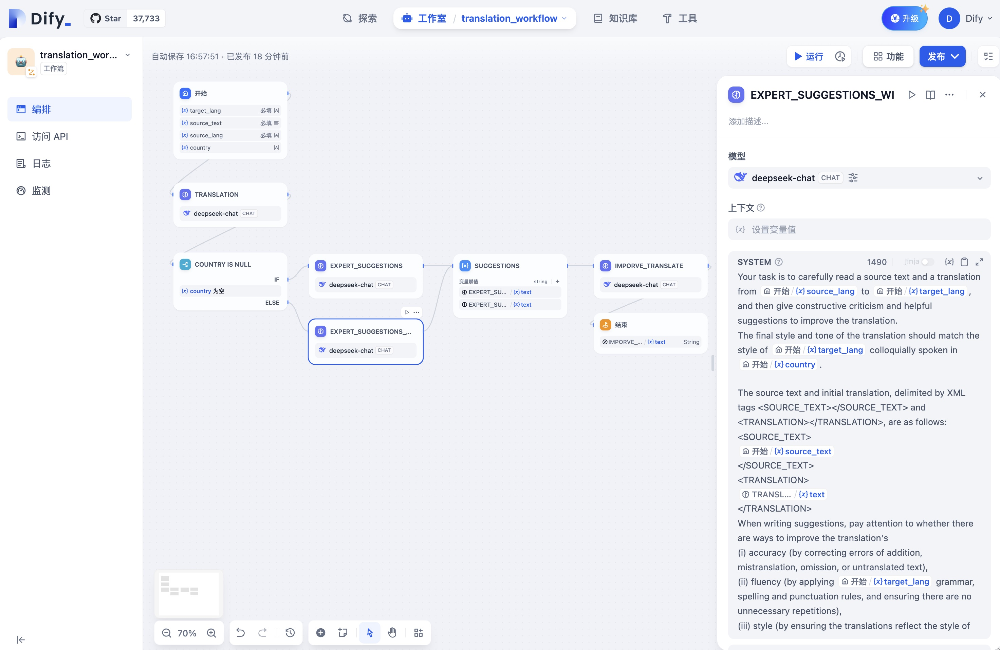 | [translation-agent](https://github.com/andrewyng/translation-agent) |
| `宝玉的英译中优化版.yml`         | 宝玉的科技文章翻译优化版本，主要优化了提示词和 xml 标签 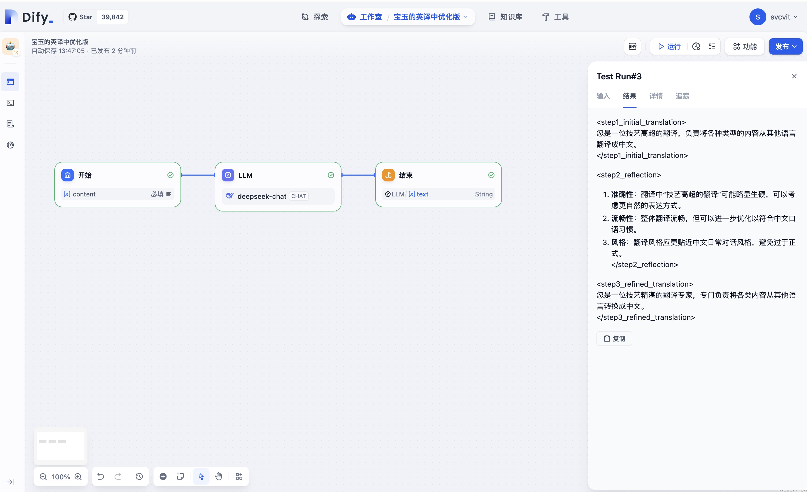 | [翻译 GPT 的提示词更新和优化](https://baoyu.io/blog/prompt-engineering/translator-gpt-prompt-v2-1-improvement) |
| `全书翻译.yml`         | DIFY 官方示例，切分长文本，再迭代器内翻译 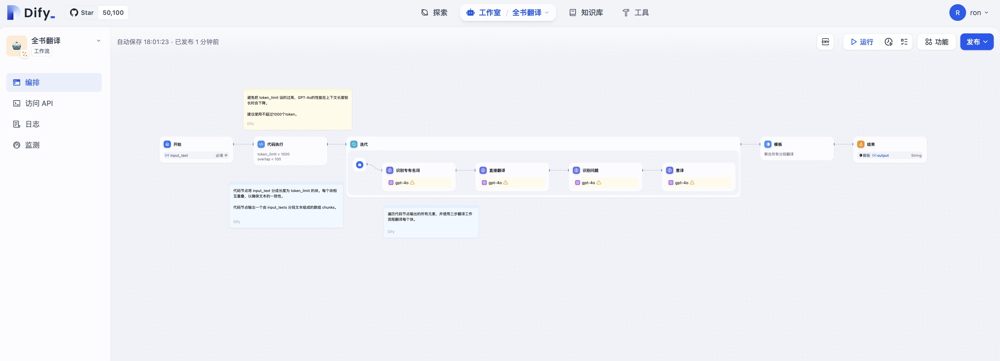 | DIFY 官方探索内容 |

## 工具

| 文件                             | 描述                                                                                                      | 来源                                                      |
| -------------------------------- | --------------------------------------------------------------------------------------------------------- | --------------------------------------------------------- |
| `SEO Slug Generator.yml`         | 给自己的博文生成 url slug，参考来源于宝玉的 X 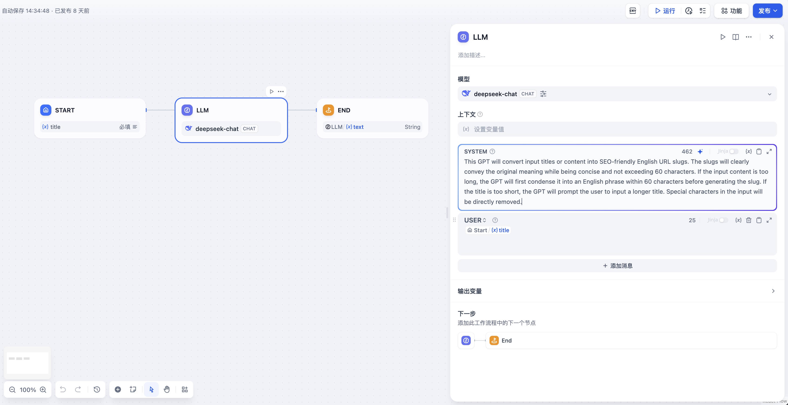   | [twitter](https://x.com/dotey/status/1801280536125608265) |
| `Document_chat_template.yml`     | 一个通过知识库聊天的模版                         | [Winson-030](https://github.com/Winson-030/dify-DSL)      |
| `搜索大师.yml`                   | 通过 SearXNG 进行搜索，再通过 jina 获取搜索内容 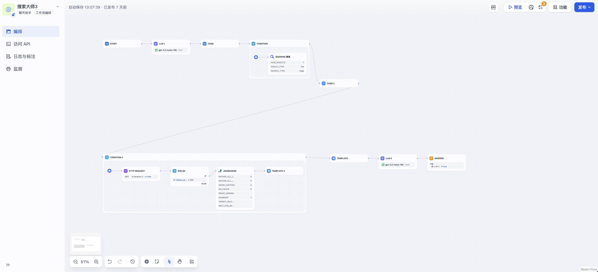 | [Winson-030](https://github.com/Winson-030/dify-DSL)      |
| `标题党创作.yml`                 | 一位爆款网文作家  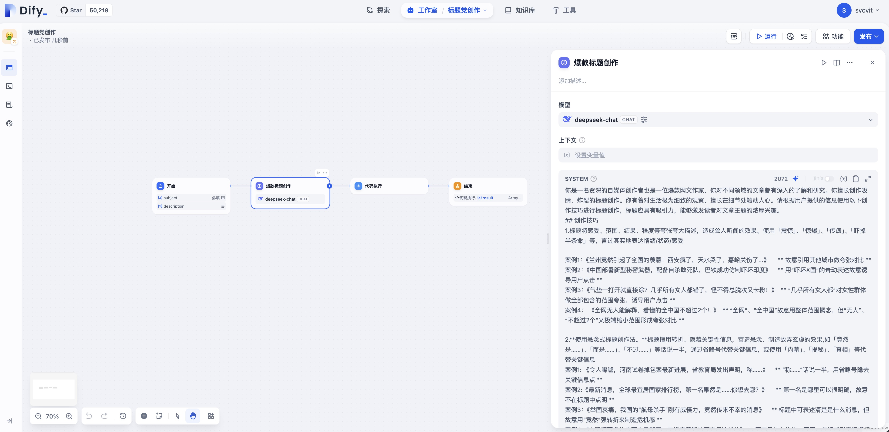       | [ghostviper](https://github.com/ghostviper/dify-workflow) |
| `文章仿写-单图_多图自动搭配.yml` | 文章仿写   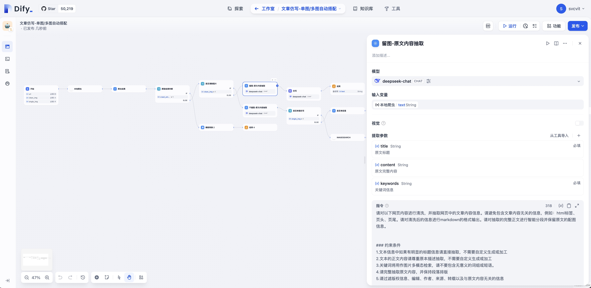               | [ghostviper](https://github.com/ghostviper/dify-workflow) |
| `Text to Card Iteration.yml`     | 自动生成小红书这种卡片。                                                                                  | 🔥Dify Workflow-Agent 设计交流 @Arthur                    |
| `Dify 运营一条龙.yml`     | 小红书、抖音、微博、B 站一条龙运营  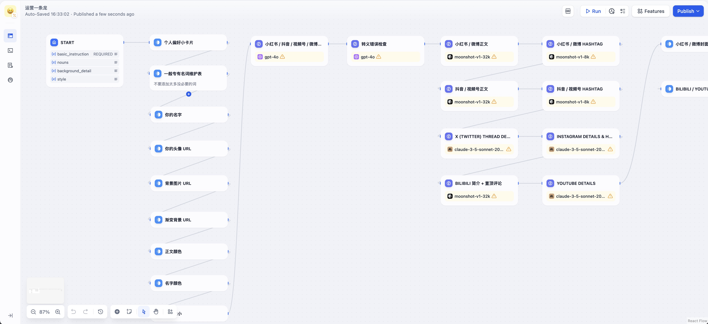   | [Dify 一键生成多尺寸 Cover 与全平台文案](https://www.youtube.com/watch?v=kCrQp8YZTsQ)                    |
| `Jina Reader Jinja.yml`     | 一个基于 TavilySearch 和 Jina 的问答流程  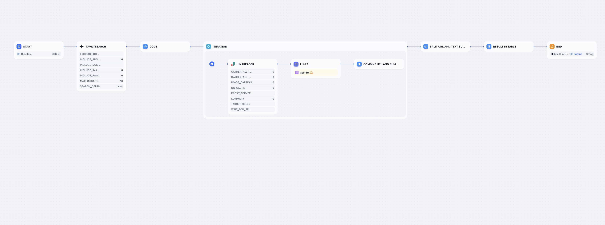   | 🔥Dify Workflow-Agent 设计交流群分享        |
| `llm2o1.cn.yml`     | 任务拆解→提取步骤→迭代步骤执行→归纳总结→输出结果 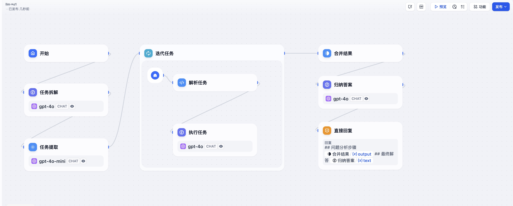   | [@okooo5km](https://x.com/okooo5km/status/1838801763778072862)  |
| `dify_course_demo.yml`     | 自动化生成全套教程。 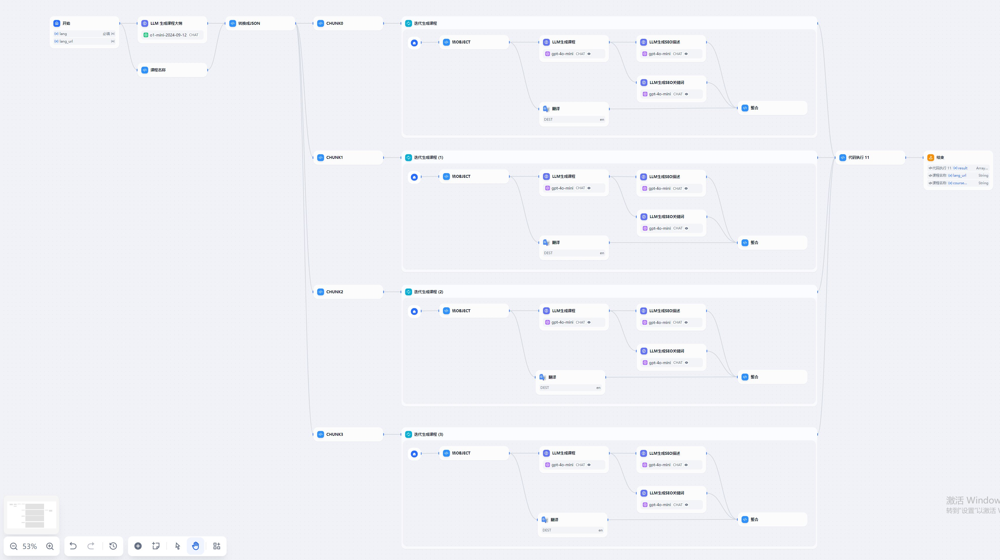   | [dify_course](https://github.com/pekingmuge/dify_course)  |
| `simple-kimi.yml`     | 简易自制 Kimi 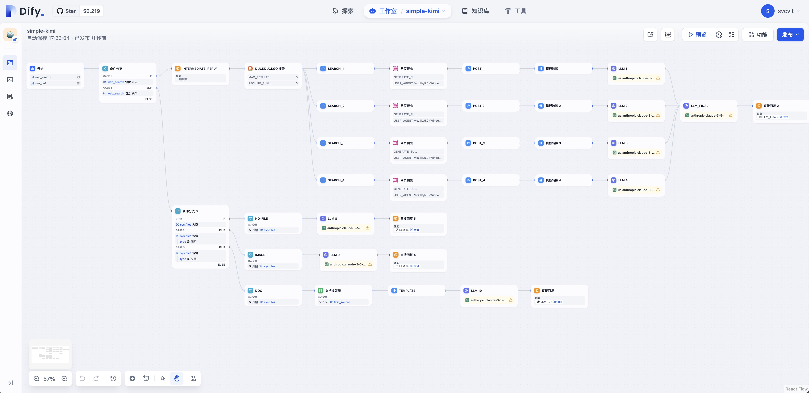   | [aws-samples](https://github.com/aws-samples/dify-aws-tool/tree/main/workflow)  |
| `Claude3 Code Translation.yml`     | 不同代码种类之间的翻译工作流 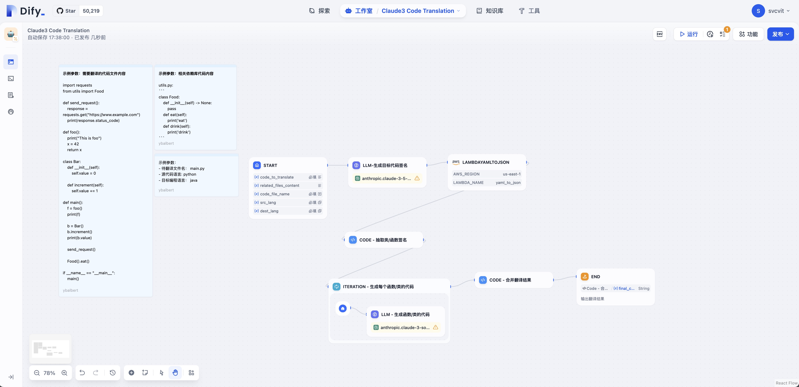   | [aws-samples](https://github.com/aws-samples/dify-aws-tool/tree/main/workflow)  |

## 聊天机器人

| 文件                         | 描述                                                                                                                                           | 来源                                                               |
| ---------------------------- | ---------------------------------------------------------------------------------------------------------------------------------------------- | ------------------------------------------------------------------ |
| `根据用户的意图进行回复.yml` | 根据用户的聊天内容，进行意图判定，根据意图选择不同的工作流路径进行回复，再风格化聊天机器人话术  | 无                                                                 |
| `mem0ai`                     | 一个有记忆的聊天流程，完整代码见来源链接 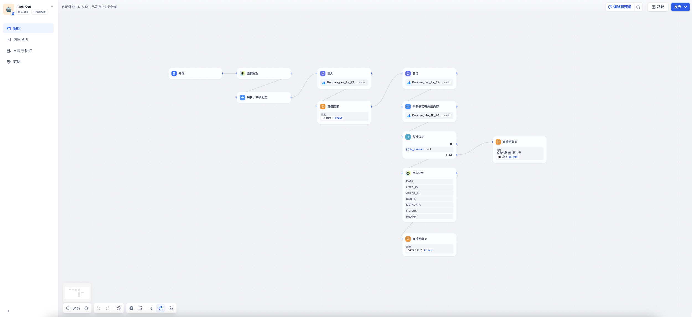                                                 | [dify-plugin-mem0ai](https://github.com/tonori/dify-plugin-mem0ai) |
| `记忆测试.yml`         | 添加短期记忆，CoT 思维链的示例，自动问答机器人也可以主动触达，根据上下文选择最佳回复 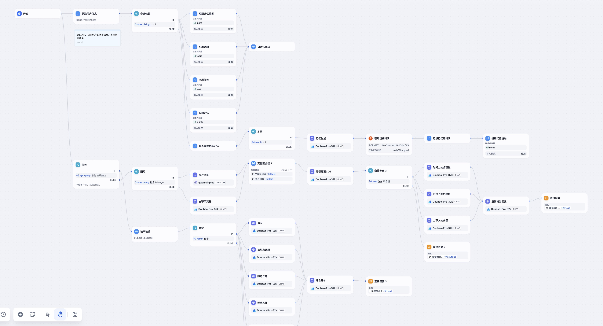               | 来自微信 svcvit |

## 代码

| 文件                       | 描述                             | 来源                                                                                                                               |
| -------------------------- | -------------------------------- | ---------------------------------------------------------------------------------------------------------------------------------- |
| `Python Coding Prompt.yml` | 通过聊天对话方式生成 Python 代码 | [Sonnet 3.5 for Coding 😍 - System Prompt](https://www.reddit.com/r/ClaudeAI/comments/1dwra38/sonnet_35_for_coding_system_prompt/) |

## 使用方法

注册 [Dify](https://cloud.dify.ai/) 账号，添加模型。

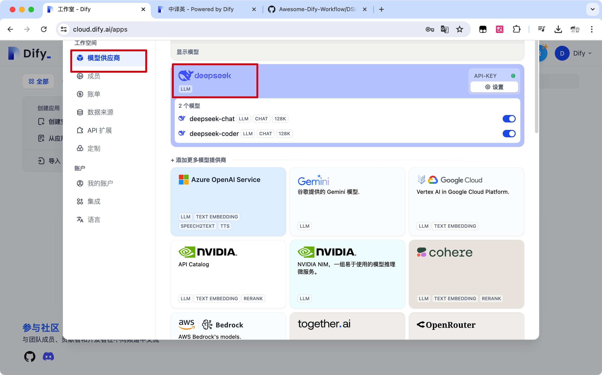

复制 Workflow 的 URL，导入 DLS 文件即可，发布你自己的 Workflow，既可以使用。当然，你可以进行必要的调整，例如模版的调整，或提示词的调整。

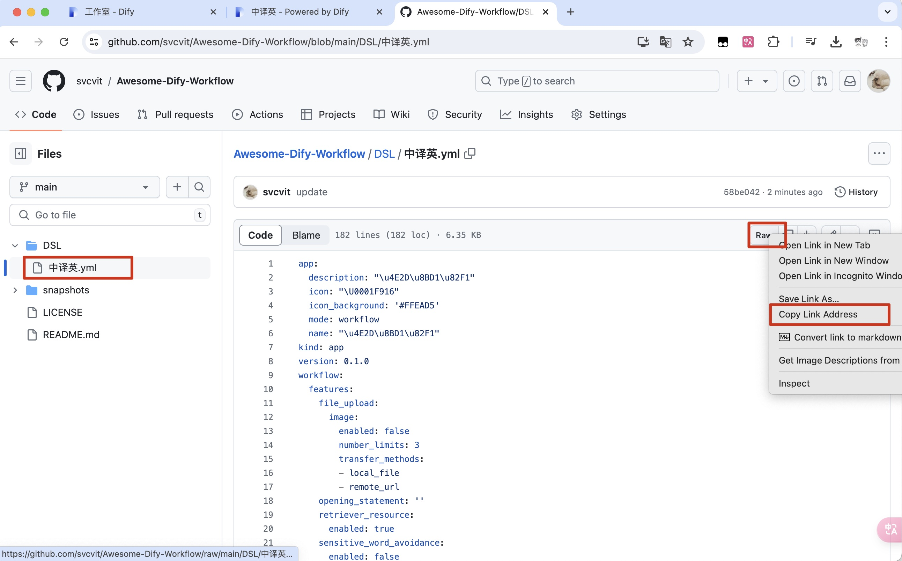

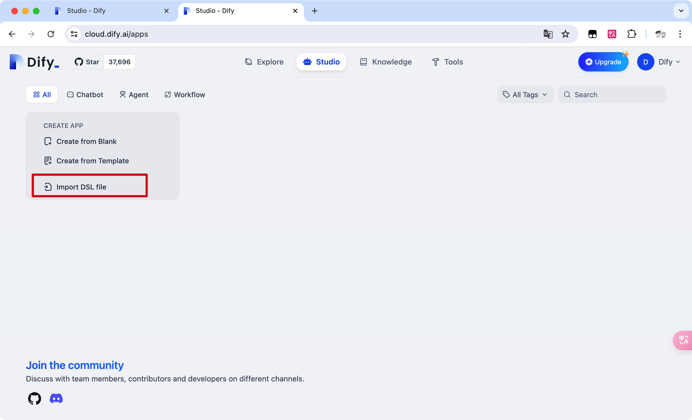

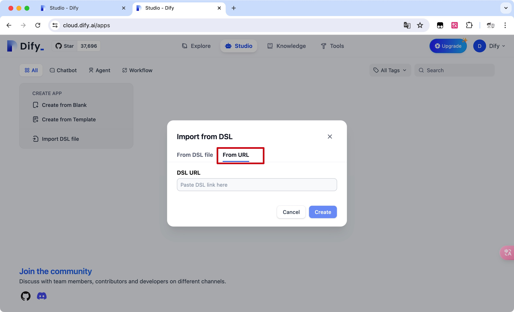
