# Awesome-Dify-Workflow

[English](README_EN.md) | [中文](README.md)

Share some useful Dify workflows, suitable for both personal use and learning. Please use **Dify version 0.13.0 or above** to import. Features like **parallel tasks**, **session variables**, **forms**, and **echart rendering** are now supported. Agent nodes are a feature of version 1.0 and later, please use the latest version of DIFY for import whenever possible.

All Workflows are basically **free** to use. More Workflows are being collected and organized...

## Sharing Group
A wechat sharing group has been created, feel free to join if interested. If you have questions about workflows, we can discuss them together. (Updated 2025/04/17)
- The main groups are over 200 members. Add the group owner's friend, mention "dify", and you'll be added to a larger group. However, WeChat risk control sometimes prevents adding, you can try again later.
- Of course, you can also join the new groups, which currently have fewer people. A group usually fills up to 200 members in 1-2 days.

## Frequently Asked Questions
Here are some common questions from the group, updated periodically. The content won't be extensive, but hopefully helpful.

[AI Workflow Platform Comparison——Dify, Fastgpt, Ragflow](https://zerozzz.win/ai-%E6%B5%81%E7%A8%8B%E5%B9%B3%E5%8F%B0%E5%AF%B9%E6%AF%94dify%E3%80%81fastgpt%E3%80%81ragflow) (Note: Link is in Chinese)

Is there a domestic mirror source configuration for Dify in China?

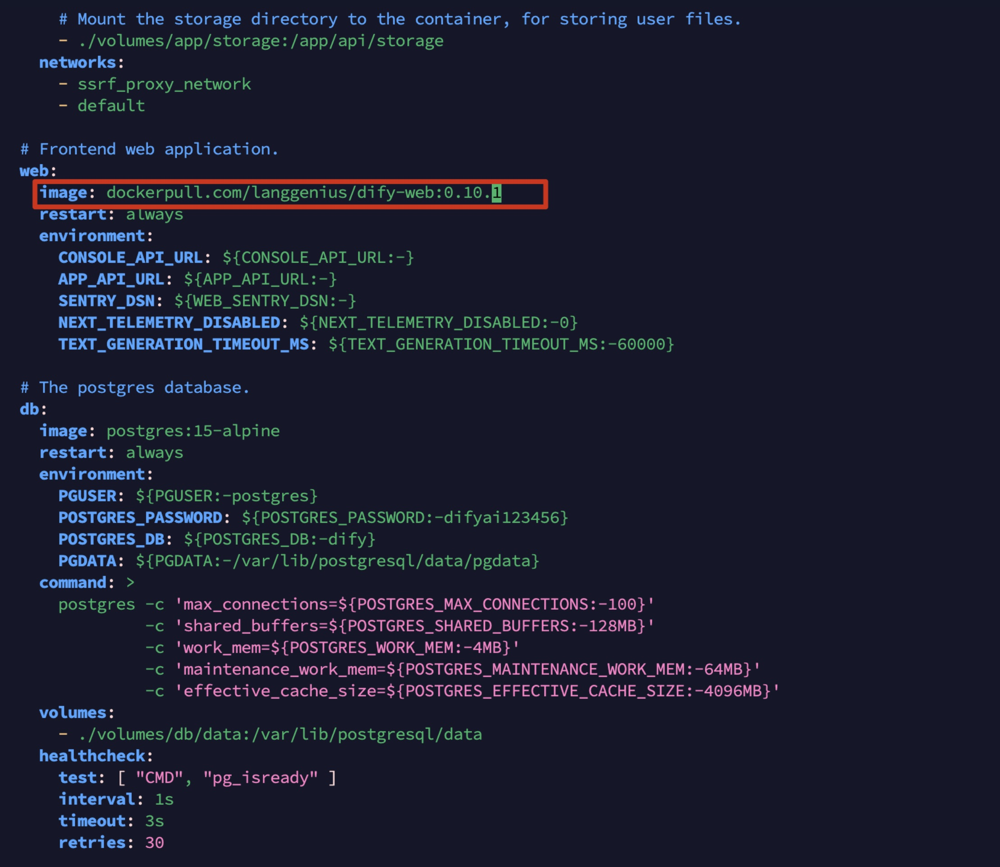

A: I usually prefix all image links with `dockerpull.org`.

How to install third-party libraries like pandas in sandbox?

A: Open `/docker/volumes/sandbox/dependencies/python-requirements.txt`, add the required dependencies, and restart sandbox.

How can scheduled tasks be handled? I want to run a certain workflow periodically.

A: You can refer to the project https://github.com/leochen-g/dify-schedule

Passing string data between nodes shows limit exceeded, how to handle this?

A: Modify a section in `.env`:
CODE_MAX_STRING_LENGTH: 1000000
TEMPLATE_TRANSFORM_MAX_LENGTH: 1000000
Restart the container.

After getting an image URL, can it be displayed in the chat window? I tried markdown but nothing showed up.

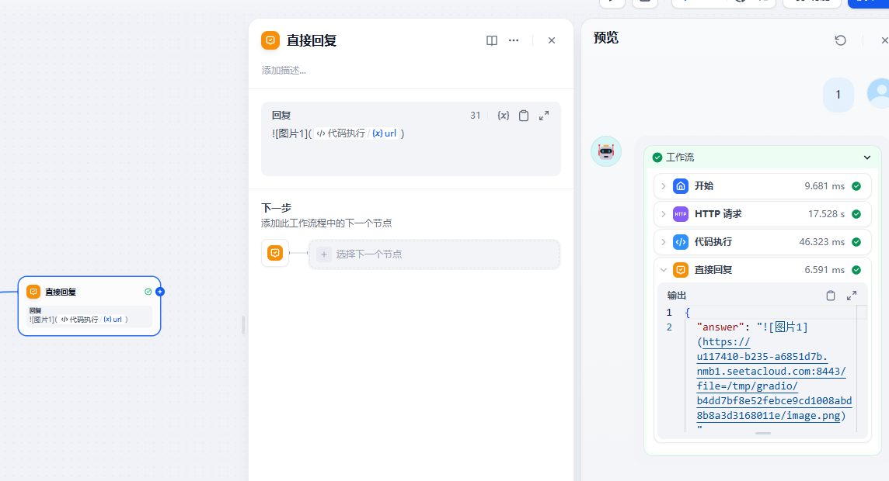

A: Your approach is correct, but the image isn't showing because it doesn't support cross-origin requests (CORS).

I have a question, uploading large files to the knowledge base results in an error. After modifying the configuration file, I still can't upload large files. Here is the modified part in the configuration file for file upload;

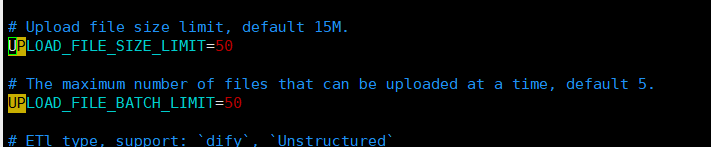

A: Nginx also needs to be modified; it's in the .env file; search for `nginx`, you should be able to find it.

Knowledge base perpetual queuing issue

A: Modify this line in `.env`: `LOG_FILE=/app/logs/server.log`; then restart the container.

Where can I self-study Dify?

A: You can refer to https://dify101.com

What are good solutions for generating charts in Dify?

A: Dify has some built-in charting functions, including bar charts, line charts, etc. You can also write an Echarts plugin yourself to read data from a database and draw charts.

Is DuckDuckGo translation unavailable now?

A: It's likely the server has a proxy enabled, but Dify, running inside Docker, does not.

Exploring Dify's official example applications, they are all in English. How to switch to Chinese?

A: Click on your profile picture in the top right corner, Settings, Language, first switch to another language, then switch back to Chinese.

What to do if I forgot the admin password?

A: Execute the following command: `docker exec -it docker-api-1 flask reset-password`

## SANDBOX
If running pandas, numpy>2.0, matplotlib, scikit-learn code in the sandbox keeps throwing errors, you can use another simple version I developed: [dify-sandbox-py](https://github.com/svcvit/dify-sandbox-py). These dependencies have been tested and work.

## DIFY 1.0 Plugins
The [dify_plugin_collection](https://github.com/svcvit/dify_plugin_collection) repository stores installation packages for DIFY's [official marketplace](https://marketplace.dify.ai/) plugins, convenient for offline users to choose freely, updated periodically.

If you wish to develop plugins, I have source code for two plugins: [google translate](https://github.com/svcvit/dify-plugin-google_translate) and [conversation Agent](https://github.com/svcvit/dify-plugin-tod_agent), hoping they can serve as a reference.

## Reference Screenshots

All DSLs are in workflow mode, which can be conveniently published as tools and embedded in ChatBot processes. Workflows include basic inputs, conditional judgments, variable aggregators, outputs, and other components.

# DSL Directory

You can refer to the description of each yml below to find the Workflow you need, then locate the corresponding file in the DSL folder, copy the file's URL, and import it into your Dify account.

## 2025-04-17 Update
| File                               | Description                                                                                                                                                                           | Source                                                                |
| ---------------------------------- | ------------------------------------------------------------------------------------------------------------------------------------------------------------------------------------- | ------------------------------------------------------------------- |
| `sanic-web`                        | This is a database Q&A project using DIFY as the service layer, with an independent web interaction interface. Please visit https://github.com/apconw/sanic-web for details. The project is highly complete; follow the documentation step by step to start. Using ollama's qwen and deepseek models yields good results. 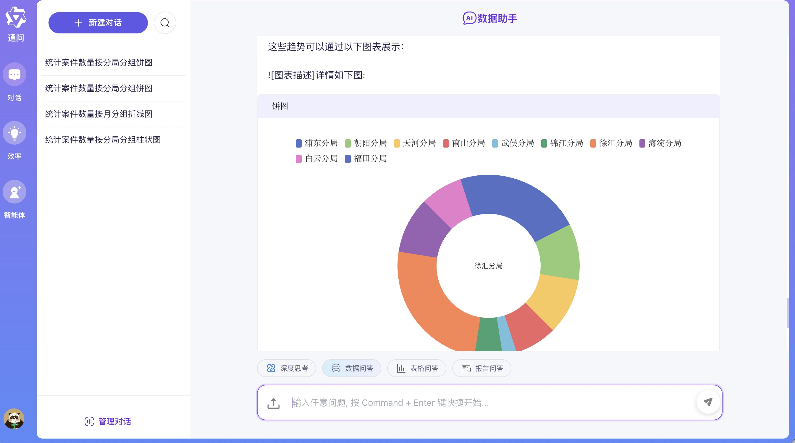 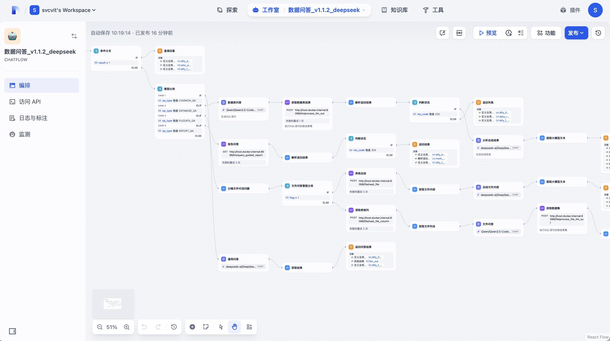 |   [sanic-web](https://github.com/apconw/sanic-web)   |

## 2025-04-16 Update
| File                               | Description                                                                                                                                                                           | Source                                                                |
| ---------------------------------- | ------------------------------------------------------------------------------------------------------------------------------------------------------------------------------------- | ------------------------------------------------------------------- |
| `MCP-amap.yml`                     | Example of using the [MCP Agent strategy](https://marketplace.dify.ai/plugins/hjlarry/agent) to call MCP tools. MCP uses the online service provided by [Amap (高德地图)](https://lbs.amap.com/api/mcp-server/gettingstarted). You can register a developer account first and apply for a free Key. Replace the masked part in the image below  There is also an official example [Dify MCP Plugin Guide: Connect Zapier with One Click, Easily Call 7000+ App Tools](https://mp.weixin.qq.com/s/CDhqmLO1JXSB__aUMqoGoQ) (Note: Link is in Chinese) |   [@svcvit](https://vcvit.me/)   |

## 2025-04-07 Update
| File                               | Description                                                                                                                                                                           | Source                                                                |
| ---------------------------------- | ------------------------------------------------------------------------------------------------------------------------------------------------------------------------------------- | ------------------------------------------------------------------- |
| `图文知识库` (Image-Text Knowledge Base) | If you want the knowledge base retrieval effect to be text accompanied by images, you need to add remote image links in the knowledge base. Refer to this example, which includes a markdown file. 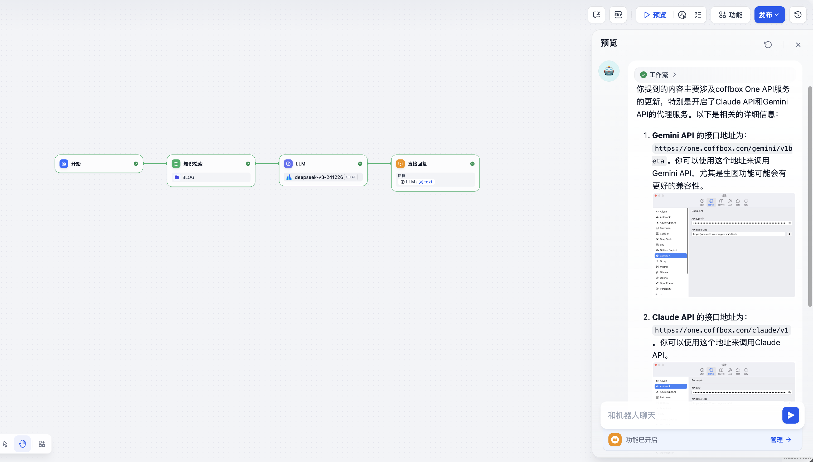 |   [@svcvit](https://vcvit.me/)   |

## 2025-03-21 Update
| File                               | Description                                                                                                                                                                           | Source                                                                |
| ---------------------------------- | ------------------------------------------------------------------------------------------------------------------------------------------------------------------------------------- | ------------------------------------------------------------------- |
| `Demo-tod_agent.yml`               | Uses Dify 1.0's Agent node, an Agent strategy optimized for dialogue scenarios, e.g., multi-turn conversations, context understanding, information gathering, etc. https://marketplace.dify.ai/plugins/svcvit/agent 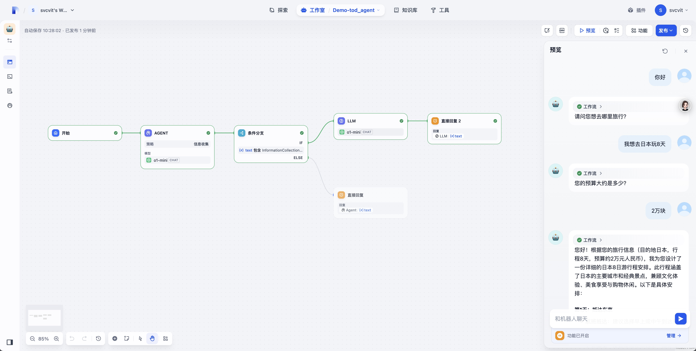 |   [@svcvit](https://vcvit.me/)   |

## 2025-02-24 Update
| File                               | Description                                                                                                                                                                           | Source                                                                |
| ---------------------------------- | ------------------------------------------------------------------------------------------------------------------------------------------------------------------------------------- | ------------------------------------------------------------------- |
| `Deep Researcher On Dify .yml`     | Deep Researcher workflow replication solution 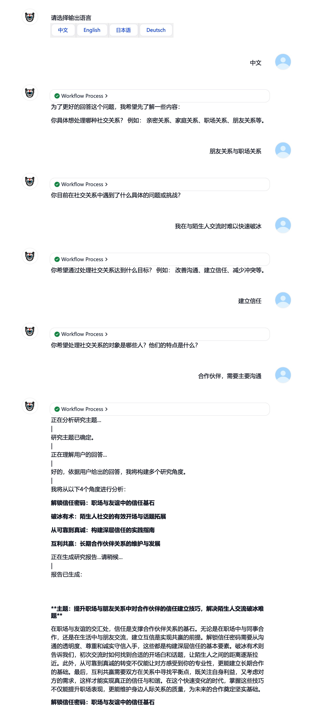  |   [@AdamPlatin123](https://github.com/AdamPlatin123/Open-Deep-Research-workflow-on-Dify)   |

## 2025-02-17 Update
| File                               | Description                                                                                                                                                                           | Source                                                                |
| ---------------------------------- | ------------------------------------------------------------------------------------------------------------------------------------------------------------------------------------- | ------------------------------------------------------------------- |
| `Agent工具调用.yml` (Agent Tool Calling) | Uses Dify 1.0's Agent node, utilizing Function Calling (FC) to invoke different tools for responses.   |   [@svcvit](https://vcvit.me/)   |

## 2025-01-23 Update
| File                               | Description                                                                                                                                                                           | Source                                                                |
| ---------------------------------- | ------------------------------------------------------------------------------------------------------------------------------------------------------------------------------------- | ------------------------------------------------------------------- |
| `旅行Demo.yml` (Travel Demo)        | Uses Dify 1.0's Agent node to demonstrate travel information gathering, Tool invocation, and dialogue history context storage. Stores conversation messages in session variables to include in the Agent's thinking context. 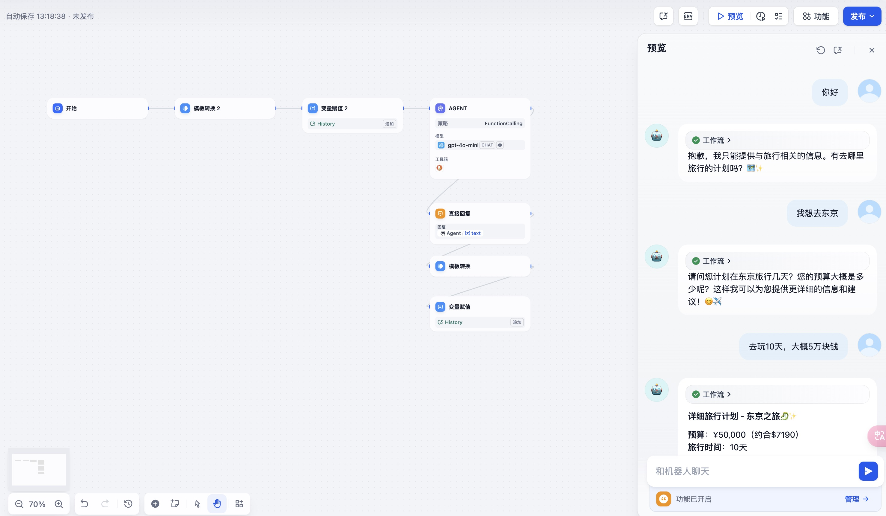    |   [@svcvit](https://vcvit.me/)   |

## 2025-01-21 Update
| File                               | Description                                                                                                                                                                           | Source                                                                |
| ---------------------------------- | ------------------------------------------------------------------------------------------------------------------------------------------------------------------------------------- | ------------------------------------------------------------------- |
| `春联生成器.yml` (Spring Couplet Generator) | Spring couplet generation tool. Note: requires the font to be installed on the computer, can modify the font as needed.   |  WeChat Group @Junjie.M   |
| `春联生成器 (“福”到了版本).yml` (Spring Couplet Generator - "Fu Arrived" Version) |  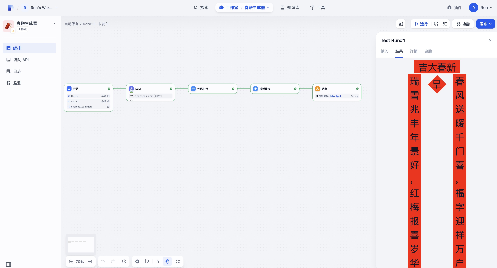    |  WeChat Group @Junjie.M  |
| `完蛋！我被LLM包围了！ .yml` (OMG! Surrounded by LLMs!) | 【OMG! Surrounded by LLMs!】Inspired by: https://github.com/modelscope/modelscope/tree/master/examples/apps/llm_riddles  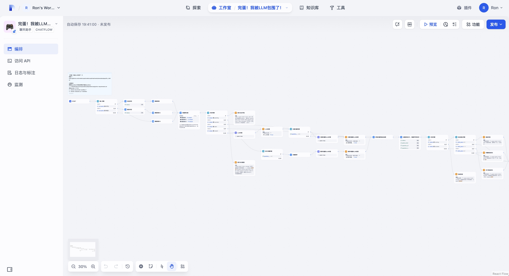    |  WeChat Group @Junjie.M  |

## 2024-12-05 Update
| File                               | Description                                                                                                                                                                           | Source                                                                |
| ---------------------------------- | ------------------------------------------------------------------------------------------------------------------------------------------------------------------------------------- | ------------------------------------------------------------------- |
| `File_read.yml`                    | Use sandbox to read and parse files. Requires [dify-sandbox-py](https://github.com/svcvit/dify-sandbox-py) and mounting the upload directory. This is an example of pandas reading CSV. Refer to the source link on the right for specific methods. 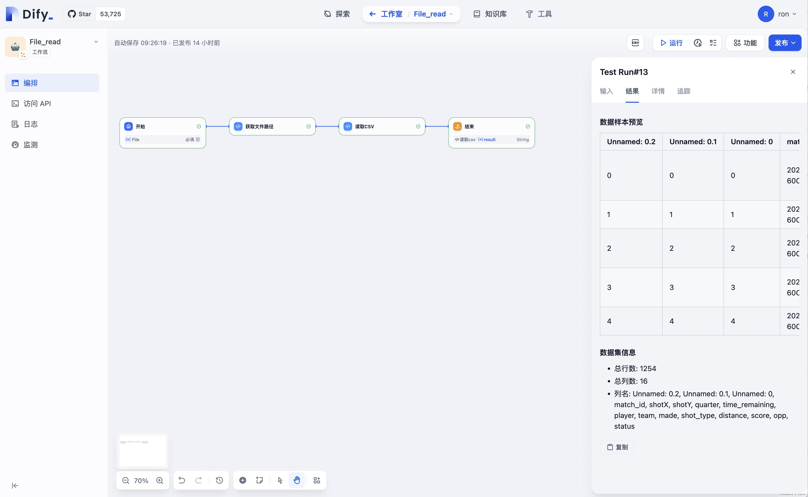    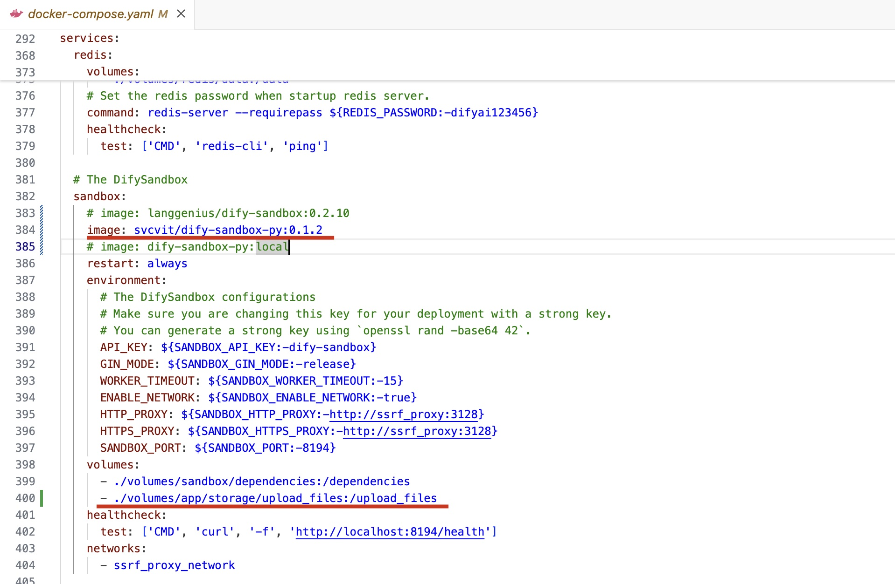  |  [@svcvit](https://blog.vcvit.me/2024/12/05/use-dify-sandbox-to-parse-files/) (Note: Blog post might be in Chinese) |
| `runLLMCode.yml`                   | Execute code generated by LLM via sandbox. Since the code node cannot directly reference LLM's code, it's executed via HTTP request. Here is an example of analyzing CSV. 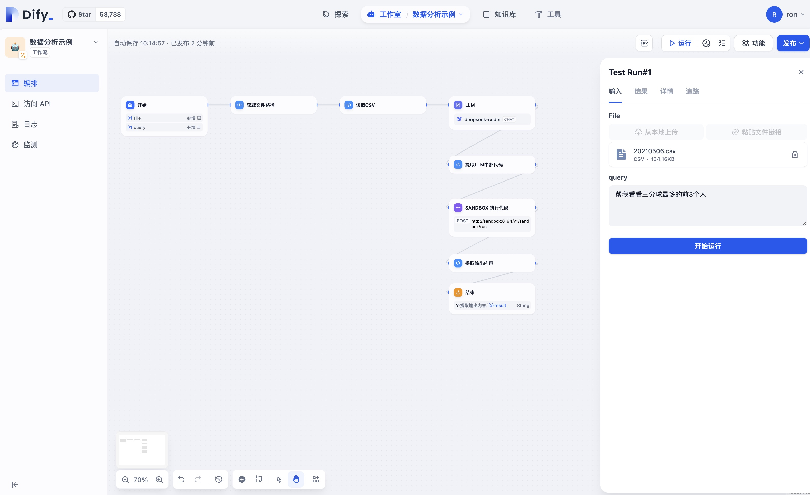   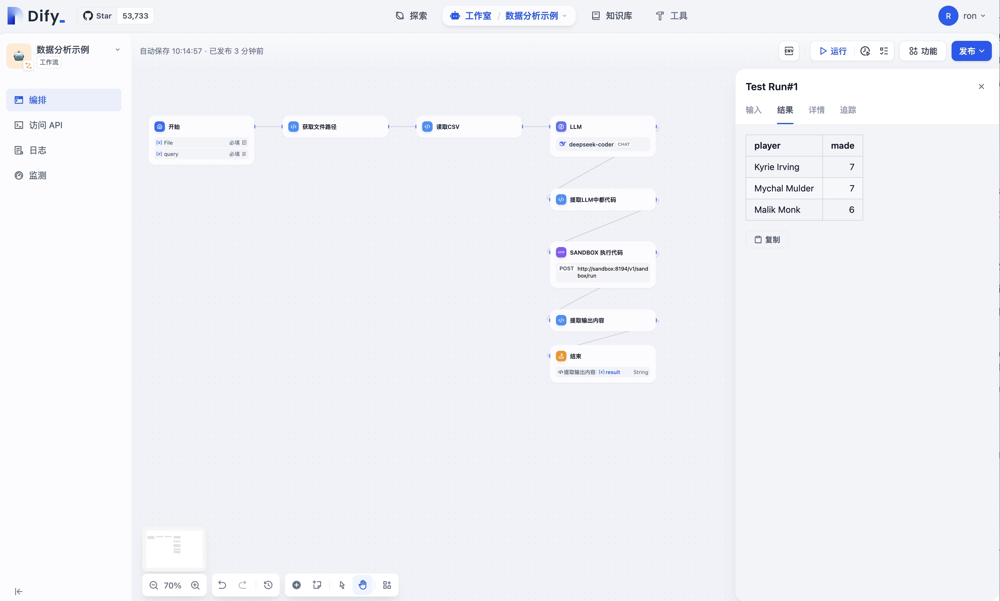      |  [@svcvit](https://vcvit.me/)    |
| `数据分析.7z` (Data Analysis)      | Data analysis example. Can query the database according to requirements, generate corresponding interpretations and charts. The example includes the workflow file and a Flask service. 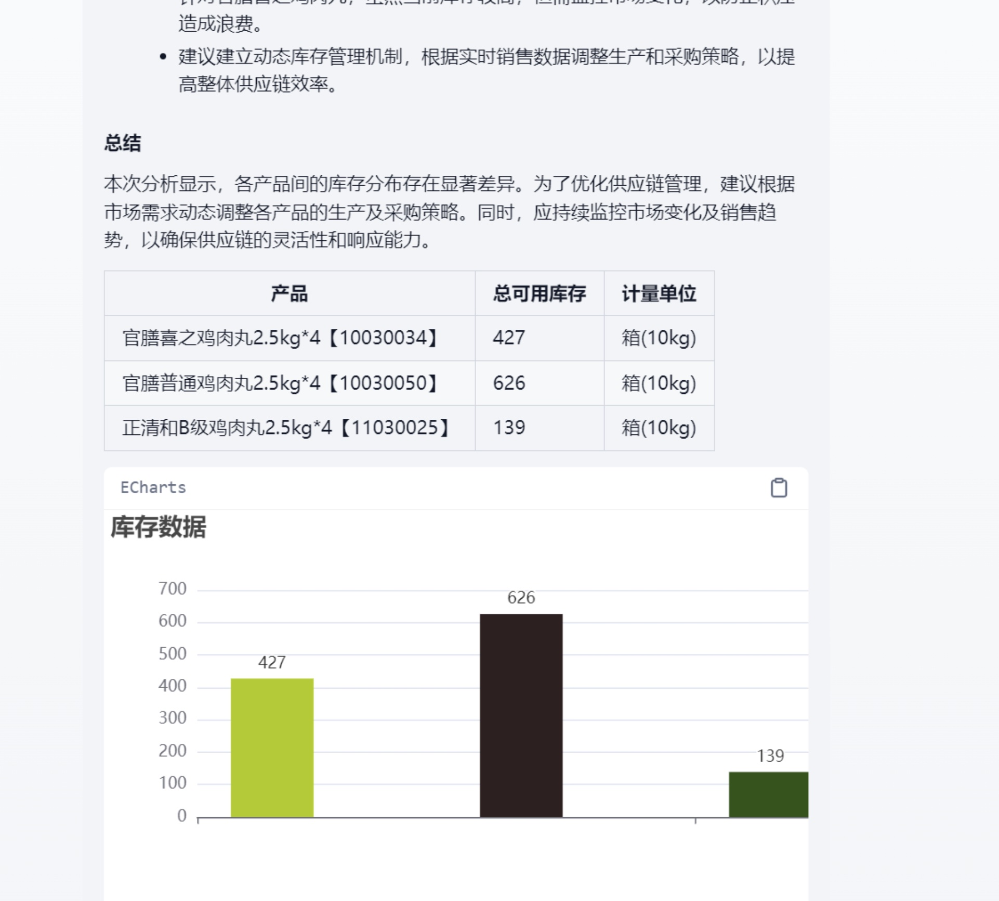   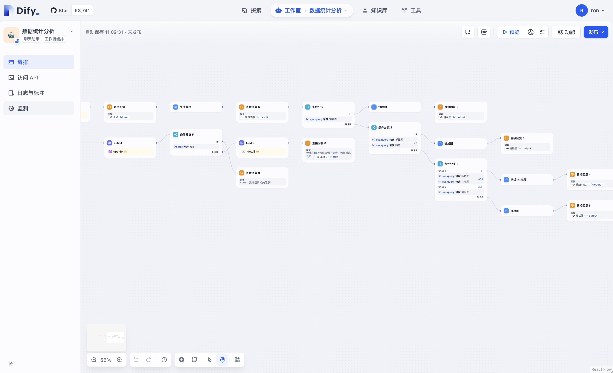      |  WeChat Group: 简单&平凡@ (Simple & Ordinary@) |

## 2024-11-29 Update
| File                               | Description                                                                                                                                                                           | Source                                                                |
| ---------------------------------- | ------------------------------------------------------------------------------------------------------------------------------------------------------------------------------------- | ------------------------------------------------------------------- |
| `LanguageConsistencyChecker.yml`   | Tri-lingual checker, mainly for optimizing translated content. It also has a companion web frontend. 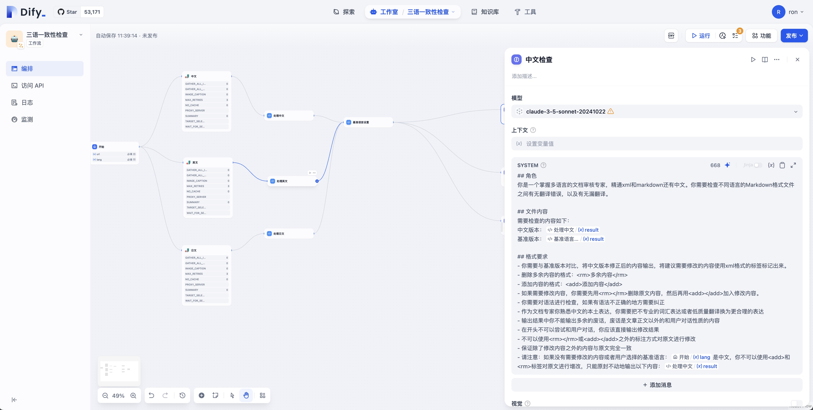    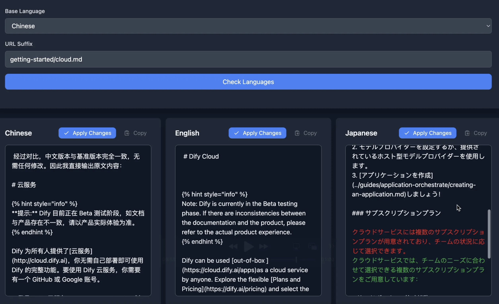      |  [langfixer](https://github.com/stvlynn/langfixer)   |

## 2024-11-22 Updates
| File                               | Description                                                                                                                                                                           | Source                                                                |
| ---------------------------------- | ------------------------------------------------------------------------------------------------------------------------------------------------------------------------------------- | ------------------------------------------------------------------- |
| `matplotlib.yml`                   | Use matplotlib for plotting, output images as base64, and render through replies. Note: Official sandbox has complex permissions, matplotlib won't work even after installation. Please use [dify-sandbox-py](https://github.com/svcvit/dify-sandbox-py) 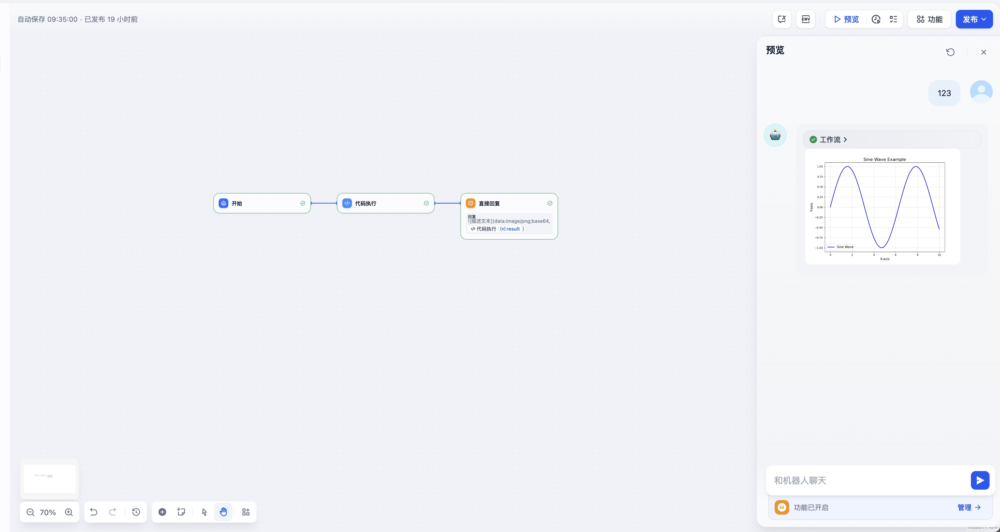 |  [@svcvit](https://vcvit.me/)   |
| `jieba.yml`                        | Jieba word segmentation example, please use [dify-sandbox-py](https://github.com/svcvit/dify-sandbox-py) 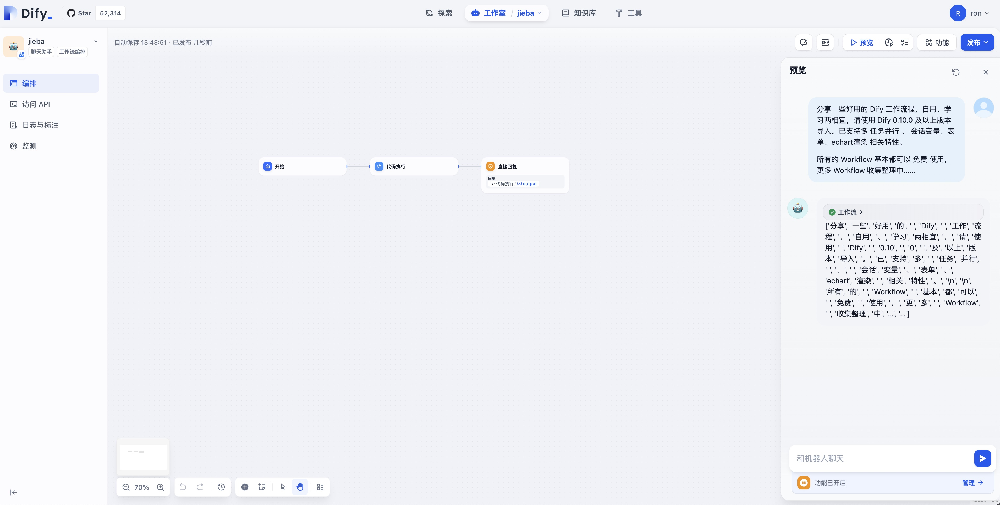 |  [@svcvit](https://vcvit.me/)   |

## 2024-11-20 Updates
| File                               | Description                                                                                                                                                                           | Source                                                                |
| ---------------------------------- | ------------------------------------------------------------------------------------------------------------------------------------------------------------------------------------- | ------------------------------------------------------------------- |
| `json-repair.yml`                  | Fix non-standard JSON output from large models (missing quotes, extra brackets) into parseable JSON 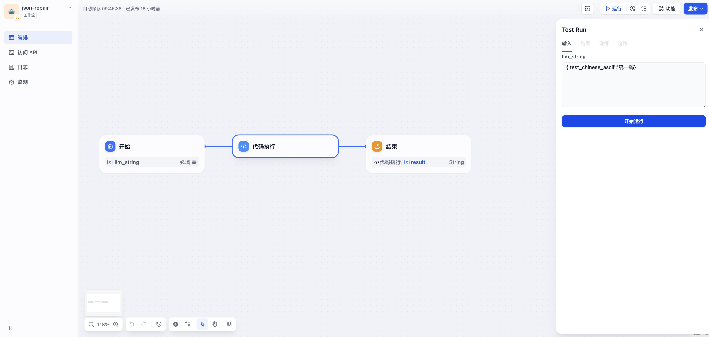 |  [@svcvit](https://vcvit.me/)  |

## 2024-11-15 Updates
| File                               | Description                                                                                                                                                                           | Source                                                                |
| ---------------------------------- | ------------------------------------------------------------------------------------------------------------------------------------------------------------------------------------- | ------------------------------------------------------------------- |
| `json_translate.yml`               | Parse content for translation in JSON, use iterator for translation, and combine into new JSON while maintaining original structure  |  [@svcvit](https://vcvit.me/)   |

## 2024-11-14 Updates
| File                               | Description                                                                                                                                                                           | Source                                                                |
| ---------------------------------- | ------------------------------------------------------------------------------------------------------------------------------------------------------------------------------------- | ------------------------------------------------------------------- |
| `腾讯云SubtitleInfo.yml` (Tencent Cloud SubtitleInfo) | A code-related example for Tencent Cloud authorization information encryption to get needed content info. Reference for using code nodes.  | WeChat Sharing Group  |
| `chart_demo.yml`                   | Render charts through reply content. You can also combine with SQL queries to generate required content  |   [@svcvit](https://vcvit.me/)    |

## 2024-11-12 Updates
| File                               | Description                                                                                                                                                                           | Source                                                                |
| ---------------------------------- | ------------------------------------------------------------------------------------------------------------------------------------------------------------------------------------- | ------------------------------------------------------------------- |
| `Form表单聊天Demo.yml` (Form Chat Demo) | Access models after logging in through a form in the dialog box  |  [@svcvit](https://vcvit.me/)   |

## Translation

| File                               | Description                                                                                                                                                                           | Source                                                                |
| ---------------------------------- | ------------------------------------------------------------------------------------------------------------------------------------------------------------------------------------- | ------------------------------------------------------------------- |
| `中译英.yml` (Chinese to English) | Using Baoyu's Prompt, literal translation -> reflection -> idiomatic translation, to convert Chinese into high-quality English.  | N/A                                                                 |
| `DuckDuckGo 翻译+LLM 二次翻译.yml` (DuckDuckGo Translate + LLM Second Translation) | Similar to three-step translation, but replaces the first literal translation with a traditional translation engine, saving Tokens, improving efficiency and quality.  | N/A                                                                 |
| `translation_workflow.yml`         | Using Agentic Workflow proposed by Andrew Ng, input `input language`, `target language`, `country`, `original text` (4 parameters) to provide more nuanced translation results  | [translation-agent](https://github.com/andrewyng/translation-agent) |
| `宝玉的英译中优化版.yml` (Baoyu's Eng-to-Chi Optimized) | Baoyu's optimized version for translating tech articles, mainly optimizing prompts and XML tags  | [Translator GPT Prompt Update and Optimization](https://baoyu.io/blog/prompt-engineering/translator-gpt-prompt-v2-1-improvement) (Note: Link is in Chinese) |
| `全书翻译.yml` (Full Book Translation) | DIFY official example, splits long text, then translates within an iterator  | DIFY Official Exploration Content |

## Tools

| File                             | Description                                                                                                      | Source                                                      |
| -------------------------------- | ---------------------------------------------------------------------------------------------------------------- | --------------------------------------------------------- |
| `SEO Slug Generator.yml`         | Generate URL slugs for blog posts, reference from Baoyu's X    | [twitter](https://x.com/dotey/status/1801280536125608265) |
| `Document_chat_template.yml`     | A template for chatting via knowledge base                         | [Winson-030](https://github.com/Winson-030/dify-DSL)      |
| `搜索大师.yml` (Search Master)   | Search using SearXNG, then retrieve search content using Jina  | [Winson-030](https://github.com/Winson-030/dify-DSL)      |
| `标题党创作.yml` (Clickbait Title Creator) | A viral web novel writer persona        | [ghostviper](https://github.com/ghostviper/dify-workflow) |
| `文章仿写-单图_多图自动搭配.yml` (Article Imitation - Auto Image Pairing) | Article imitation with automatic single/multiple image pairing                | [ghostviper](https://github.com/ghostviper/dify-workflow) |
| `Text to Card Iteration.yml`     | Automatically generates cards like those on Xiaohongshu (Little Red Book).                                      | 🔥Dify Workflow-Agent Design Exchange Group @Arthur       |
| `Dify 运营一条龙.yml` (Dify Full Marketing Suite) | One-stop operation for Xiaohongshu, Douyin, Weibo, Bilibili. (Updated 2024/11/21: Main flow is likely broken due to image generation service issues and resolution limits, rendering incorrect images. Consider it for the concept.)    | [Dify One-Click Generation of Multi-Size Cover & Full Platform Copy](https://www.youtube.com/watch?v=kCrQp8YZTsQ) |
| `Jina Reader Jinja.yml`     | A Q&A workflow based on TavilySearch and Jina    | 🔥Dify Workflow-Agent Design Exchange Group Sharing        |
| `llm2o1.cn.yml`     | Task decomposition → Extract steps → Iterate step execution → Summarize → Output results    | [@okooo5km](https://x.com/okooo5km/status/1838801763778072862)  |
| `dify_course_demo.yml`     | Automatically generate a full course tutorial set.    | [dify_course](https://github.com/pekingmuge/dify_course)  |
| `simple-kimi.yml`     | Simple self-made Kimi-like workflow    | [aws-samples](https://github.com/aws-samples/dify-aws-tool/tree/main/workflow)  |
| `Claude3 Code Translation.yml`     | Workflow for translating code between different programming languages    | [aws-samples](https://github.com/aws-samples/dify-aws-tool/tree/main/workflow)  |

## Chatbots

| File                         | Description                                                                                                                                           | Source                                                               |
| ---------------------------- | ----------------------------------------------------------------------------------------------------------------------------------------------------- | ------------------------------------------------------------------ |
| `根据用户的意图进行回复.yml` (Respond Based on User Intent) | Determines user chat intent, selects different workflow paths for response, then stylizes the chatbot's reply  | N/A                                                                |
| `mem0ai`                     | A chat process with memory. Full code available at the source link                                             | [dify-plugin-mem0ai](https://github.com/tonori/dify-plugin-mem0ai) |
| `记忆测试.yml` (Memory Test) | Example adding short-term memory and Chain of Thought (CoT). The automated Q&A bot can also proactively reach out, selecting the best response based on context  | From WeChat svcvit |

## Code

| File                       | Description                             | Source                                                                                                                               |
| -------------------------- | --------------------------------------- | ---------------------------------------------------------------------------------------------------------------------------------- |
| `Python Coding Prompt.yml` | Generate Python code via conversation | [Sonnet 3.5 for Coding 😍 - System Prompt](https://www.reddit.com/r/ClaudeAI/comments/1dwra38/sonnet_35_for_coding_system_prompt/) |

## Usage

Register for a [Dify](https://cloud.dify.ai/) account, add models.

Download this project locally, import the DSL file. Of course, you can make necessary adjustments, such as modifying templates or prompts.

