### Ron - 2025-05-08 10:49:22
Hi

---

### Ron - 2025-05-08 11:14:27
欢迎，第一位付费用户🎉('ω')🎉

---

### hjlarry - 2025-05-08 11:14:47
欢迎

---

### wxid_7da5db36yiad22 - 2025-05-08 11:14:53
哈哈哈

---

### wxid_7da5db36yiad22 - 2025-05-08 11:15:23
这两位是你们搭档吗

---

### Ron - 2025-05-08 11:15:45
多群的群友～

---

### wxid_7da5db36yiad22 - 2025-05-08 11:16:12
[坏笑]一起搞

---

### wxid_2zyfe21ojzzw22 - 2025-05-08 11:20:38
[坏笑]以后麻烦大家了，多交流

---

### wxid_7da5db36yiad22 - 2025-05-08 11:20:42
哈哈 002来了

---

### wxid_2zyfe21ojzzw22 - 2025-05-08 11:20:53
[破涕为笑]我居然不上001

---

### hjlarry - 2025-05-08 11:20:55
欢迎欢迎

---

### wxid_2zyfe21ojzzw22 - 2025-05-08 11:22:08
我想请问一下dify在做知识库查询的时候，预处理文档有没有比较好的一个方法奥

---

### wxid_2zyfe21ojzzw22 - 2025-05-08 11:22:22
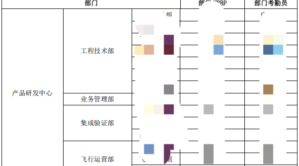

---

### hjlarry - 2025-05-08 11:22:40
其实就是常见的dify对一些文档的解析不友好？

---

### wxid_7da5db36yiad22 - 2025-05-08 11:22:40
哈哈哈

---

### wxid_2zyfe21ojzzw22 - 2025-05-08 11:22:48
比如像这些pdf里面有表格，对啊

---

### wxid_7da5db36yiad22 - 2025-05-08 11:22:52
早上我自己搭了一个做知识库的

---

### wxid_7da5db36yiad22 - 2025-05-08 11:23:03
找到了一个开源项目

---

### wxid_7da5db36yiad22 - 2025-05-08 11:23:10
不对 主要是数据集的

---

### wxid_2zyfe21ojzzw22 - 2025-05-08 11:24:32
奥奥，就是得先预处理一下嘛，然后在入库嘛

---

### wxid_2zyfe21ojzzw22 - 2025-05-08 11:24:56

---

### wxid_2zyfe21ojzzw22 - 2025-05-08 11:25:06
刚才我还找了一个这个 不知道解析的好不好

---

### hjlarry - 2025-05-08 11:25:11
是的 入库最好是markdown格式的   要想省事  就是直接外接ragflow  我觉得是最省事的了

---

### wxid_7da5db36yiad22 - 2025-05-08 11:25:33
在弄ragflow比较好

---

### wxid_671txdjl47aq21 - 2025-05-08 11:29:18
现在在作第一步，word-》归纳分级总结。遇到的问题就是1、长文本怎么输出2、总结的点怎么能准确一些

---

### wxid_2zyfe21ojzzw22 - 2025-05-08 11:30:00
他不会自带这个ocr识别这些吧

---

### wxid_671txdjl47aq21 - 2025-05-08 11:31:40
不固定，估计4W字内

---

### hjlarry - 2025-05-08 11:34:09
你这个和模型本身的能力强相关，我会先去尝试在线的gemini系列的模型  它是支持最多上下文的一种模型    先看看最好的模型能不能把它处理的达到你要的总结效果

---

### wxid_2zyfe21ojzzw22 - 2025-05-08 11:34:22
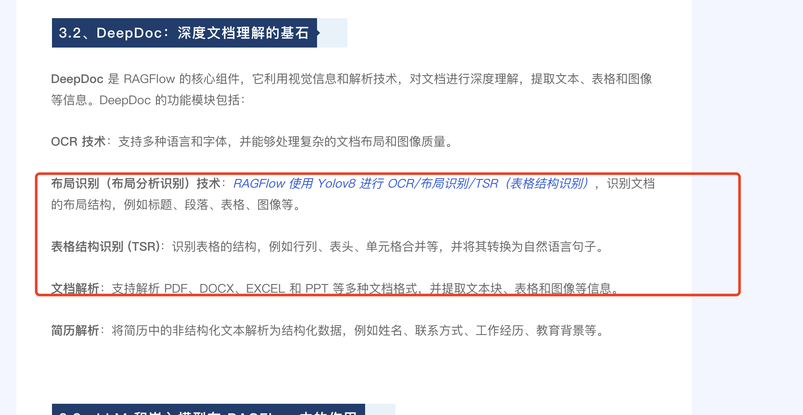

---

### wxid_2zyfe21ojzzw22 - 2025-05-08 11:34:48
这个牛的，确实[坏笑]。我感觉还是外接一个ragflow比较省事。

---

### Ron - 2025-05-08 11:34:50
@air 你的word，有示例可以发个看看么

---

### hjlarry - 2025-05-08 11:34:55
对的

---

### wxid_7da5db36yiad22 - 2025-05-08 11:35:48
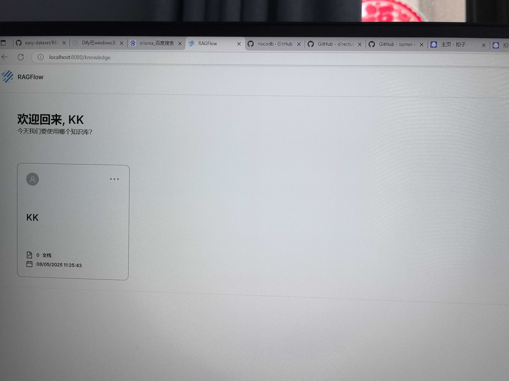

---

### wxid_7da5db36yiad22 - 2025-05-08 11:35:52
电脑随时都有

---

### wxid_7da5db36yiad22 - 2025-05-08 11:35:54
哈哈哈

---

### wxid_2zyfe21ojzzw22 - 2025-05-08 11:37:53
[旺柴]可以的

---

### wxid_2zyfe21ojzzw22 - 2025-05-08 11:38:03
看介绍确实香

---

### wxid_2zyfe21ojzzw22 - 2025-05-08 11:38:19
他这个服务器上只有cpu应该也可以运行吧

---

### hjlarry - 2025-05-08 11:38:50
CPU可以   ragflow是比较费资源的

---

### wxid_7da5db36yiad22 - 2025-05-08 11:38:51
也要跑大模型

---

### wxid_7da5db36yiad22 - 2025-05-08 11:39:05
估计就只能跑小的

---

### wxid_7da5db36yiad22 - 2025-05-08 11:39:24
你们ragflow用什么embedding模型啊

---

### hjlarry - 2025-05-08 11:42:11
embedding个人感觉都差不太多 [捂脸]

---

### wxid_7da5db36yiad22 - 2025-05-08 11:43:17
这样子吗

---

### Ron - 2025-05-08 11:57:35
我看看

---

### wxid_2zyfe21ojzzw22 - 2025-05-08 11:59:04
我感觉你这个第一步应该是结构化，先转成markdown好些，然后针对每一段进行摘要分析

---

### Ron - 2025-05-08 12:02:22
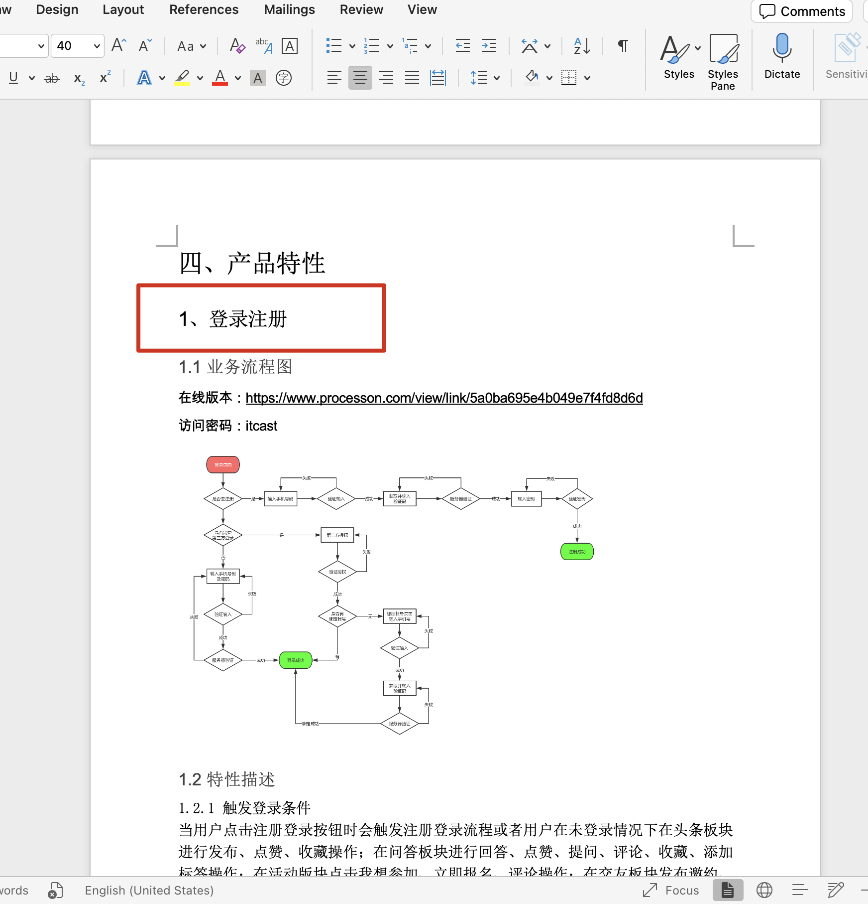

---

### Ron - 2025-05-08 12:02:53
把这些，通过正则匹配，加上一个【父级】这样类似的标记位

---

### Ron - 2025-05-08 12:03:07

---

### wwzhouhui - 2025-05-08 12:03:10
ragflow比较费资源，而且处理速算会比较慢

---

### Ron - 2025-05-08 12:03:25
再把这样开头的，添加一个【子段落】标记位

---

### Ron - 2025-05-08 12:05:10
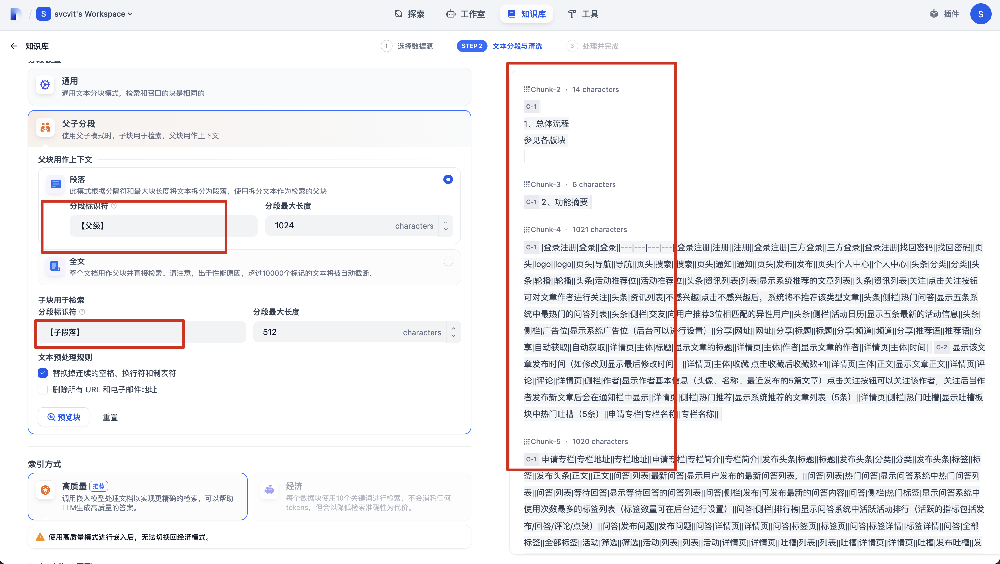

---

### Ron - 2025-05-08 12:05:45
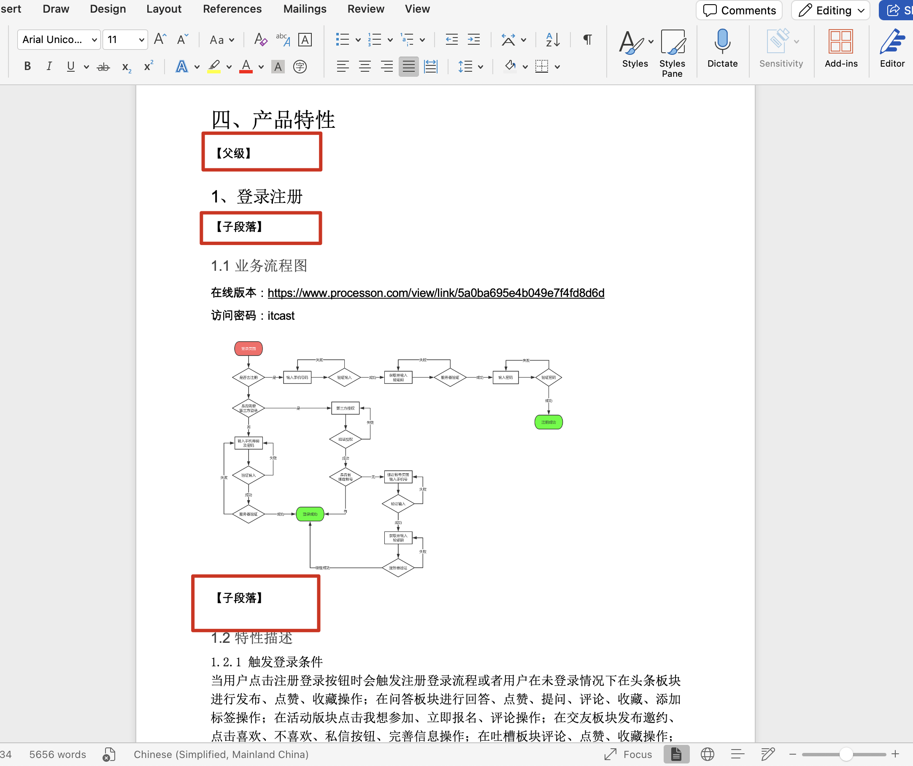

---

### Ron - 2025-05-08 12:06:02
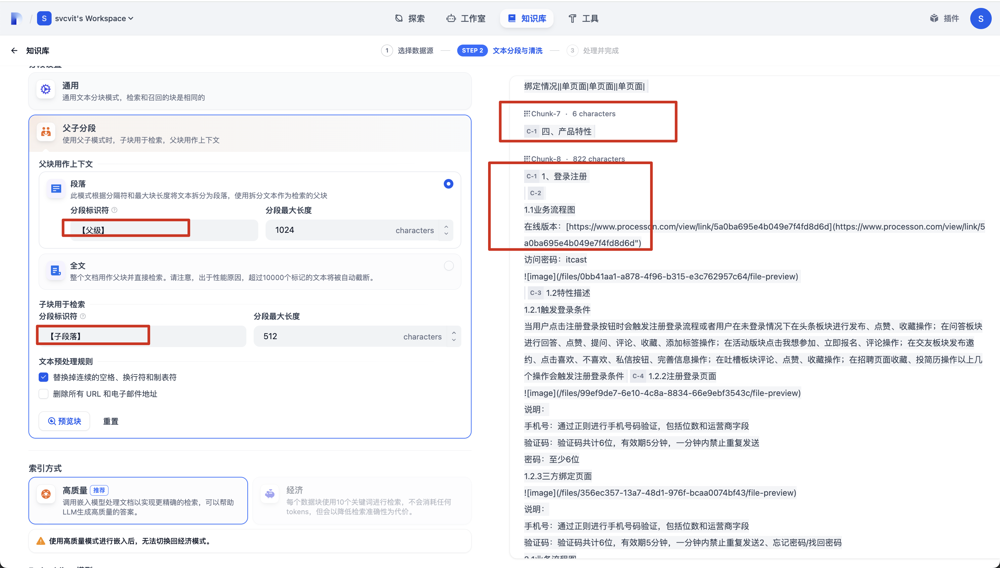

---

### Ron - 2025-05-08 12:06:16
类似这样，处理这个word，然后再父子方式放入知识库

---

### wxid_671txdjl47aq21 - 2025-05-08 12:10:27
放入知识库是为了分段吗，正常模型有这功能吗

---

### wxid_671txdjl47aq21 - 2025-05-08 12:12:02
放入知识库后，后面如何生成整篇excle

---

### hjlarry - 2025-05-08 12:13:26
大语言模型的核心瓶颈是不支持长上下文，放入知识库分段是为了解决具体问题时只找到部分相关知识，这样模型就处理的更好

---

### wwzhouhui - 2025-05-08 12:35:16
这个简单的doc转md文件参考代码

---

### wwzhouhui - 2025-05-08 12:39:33
复杂的可以用mineru

---

### wxid_9pgkq8ic90d521 - 2025-05-08 13:01:32
如果我想让ai读docx，然后处理数据，输出保留原来docx的格式，有什么方法吗，docx里有表格有颜色，有页眉页脚

---

### hjlarry - 2025-05-08 13:02:14
你的意思是ai输出的内容  要写入到原有的docx相应的地方上去？

---

### wxid_9pgkq8ic90d521 - 2025-05-08 13:02:58
或者重新组织docx，和原有的格式保持一致，你说的修改对应位置也可以

---

### Ron - 2025-05-08 13:03:46
感觉，这不是 ai 做的，是代码做的

---

### Ron - 2025-05-08 13:04:01
https://dingyu.me/blog/lessons-translator-app-beats-google-translate-deepl

---

### Ron - 2025-05-08 13:04:24
感觉像这个人做的事

---

### hjlarry - 2025-05-08 13:05:14
这个需要你自己写插件了    是一个工程上处理的事情

---

### hjlarry - 2025-05-08 13:05:47
ai只知道生成内容   但是docx不属于markdown那种通用格式   需要你自己做内容的替换

---

### wxid_9pgkq8ic90d521 - 2025-05-08 13:06:20
那有没有方法docx转markdown保留了全部格式标记的脚本，然后还可以转换回来

---

### hjlarry - 2025-05-08 13:09:01
不会的  markdown支持的格式标记是很少的   那势必转换就会丢失格式

---

### wwzhouhui - 2025-05-08 13:43:43
PDF Craft 可以将 PDF 文件转化为各种其他格式。该项目将专注于扫描书籍的 PDF 文件的处理

https://github.com/oomol-lab/pdf-craft/blob/main/README_zh-CN.md

---

### wwzhouhui - 2025-05-08 13:43:55
这个可以保持原来的格式

---

### Ron - 2025-05-08 14:10:05
[抱拳][抱拳][抱拳]

---

### wxid_9pgkq8ic90d521 - 2025-05-08 14:31:38
如果我想做一个月的新闻总结，我的思路是爬下来这些新闻，然后放到知识库中，假设每天有10条新闻，我导入后尝试总结，感觉知识库召回的文章只召回了部分给ai去总结，想问下这种有什么思路解决

---

### hjlarry - 2025-05-08 14:34:08
知识库召回是根据你的关键字去匹配找对应的文章  不会去找全量文章的 
可以考虑先对每篇新闻总结一下 存数据库   然后月末了把库里的都拿出来给ai去总结

---

### wxid_9pgkq8ic90d521 - 2025-05-08 14:34:51
有道理

---

### wxid_9pgkq8ic90d521 - 2025-05-08 14:40:48
如果我是按月来做一个总结，那我是不是应该按月建知识库，如果是按月建知识库，那我岂不是每月都要调整工作流中挂的知识库的名称，有什么自动化可以处理的方法吗

---

### hjlarry - 2025-05-08 14:46:47
如果你用知识检索这个节点的话   它是不支持动态检索不同的知识库的   如果每个月的总结都在不同知识库  看起来是得经常调整

---

### Ron - 2025-05-08 14:49:16
感觉放一个知识库，贴标签

---

### Ron - 2025-05-08 14:49:19
是不是好点

---

### wxid_7da5db36yiad22 - 2025-05-08 14:51:09
好很多了

---

### wxid_9pgkq8ic90d521 - 2025-05-08 14:52:21
这个思路挺好[ThumbsUp]

---

### Ron - 2025-05-08 14:56:37
哈哈哈，vip 群开启专家模式，讨论一下，都有个方案

---

### wxid_9pgkq8ic90d521 - 2025-05-08 15:35:57
我看微信小程序的微搭低代码平台有说可以对接dify，这部分有相关demo或者案例可以学习下吗？最好是能传图片的[Salute]

---

### Ron - 2025-05-08 15:50:26
这个我没有，感觉都还是自己开发调接口为主

---

### wxid_pgye6v6ofbws22 - 2025-05-08 17:03:47
有哪些私有工作流呀

---

### wxid_twh09qctjv7822 - 2025-05-08 18:06:11
对话 agent 插件，它的实现逻辑在代码里边都有吗？
有个有点复杂的需求，跟这个插件的功能还挺类似

---

### wxid_pgye6v6ofbws22 - 2025-05-08 18:15:48
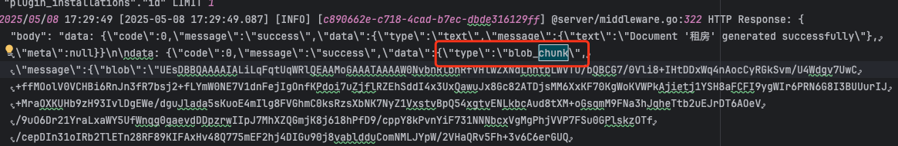

---

### wxid_pgye6v6ofbws22 - 2025-05-08 18:15:51
我注意到 dify-plugin-daemon 生成的文件类型是 blob_chunk，但 Dify 主项目目前只支持 blob 类型的处理。请问是否可以将插件返回的类型由 blob_chunk 修改为 blob

---

### wxid_pgye6v6ofbws22 - 2025-05-08 18:16:41
二开后的所有markdown转word插件都变成了blob_chunk导致用不了，不知道什么原因

---

### hjlarry - 2025-05-08 18:17:54
这个 blob chunk 是最近才加的，但是改动较大，需要 dify 本身，plugin 容器和 sdk 都更新，要么就都不更新也可以

---

### hjlarry - 2025-05-08 18:18:45
它解决的问题是大一点的多模态文件传输给大模型，导致卡死不返回

---

### wxid_pgye6v6ofbws22 - 2025-05-08 18:25:40
这样，那解决办法就是都更新

---

### hjlarry - 2025-05-08 18:26:57
对，要么都更要么都不更，比单独调一个好点

---

### hjlarry - 2025-05-08 20:08:01
@Frigo 我记错了，最近加的是 LLMResultChunk 啊，这个 blob chunk 是一直都有的，你具体遇到什么错误了吗？

---

### ani424094144 - 2025-05-08 20:20:33
目前的工作流模板都在应用模版里面是吗

---

### ani424094144 - 2025-05-08 20:20:33
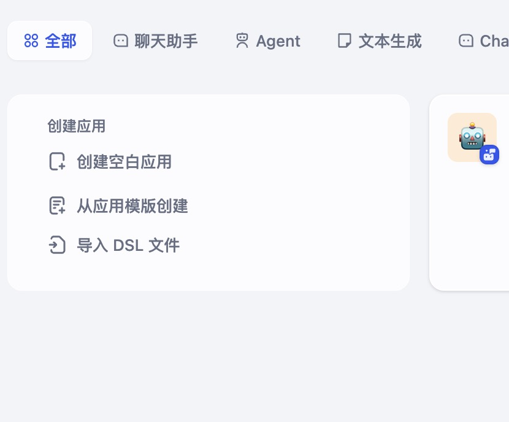

---

### ani424094144 - 2025-05-08 20:20:59
还有哪里有散落的 dsl 文件哇？

---

### wxid_pgye6v6ofbws22 - 2025-05-08 20:24:45
官网的是blob

---

### wxid_pgye6v6ofbws22 - 2025-05-08 20:24:56
先更新代码看看

---

### wwzhouhui - 2025-05-08 20:27:36
https://github.com/svcvit/Awesome-Dify-Workflow 这个里面有非官方 最全的 dsl 

---

### ani424094144 - 2025-05-08 20:27:58
好的我来看看

---

### wwzhouhui - 2025-05-08 20:28:10
https://github.com/wwwzhouhui/dify-for-dsl 这个是我开源的项目 目前也是算比较全面的。

---

### wxid_pgye6v6ofbws22 - 2025-05-08 20:30:51
明天代码全部合并更新到最新版本再看看

---

### wxid_9pgkq8ic90d521 - 2025-05-09 10:16:46
通过http的方式访问dify的工作流在哪里可以看到调用请求及运行结果吗？界面上可以看到还是服务器后台哪个日志可以看到？

---

### hjlarry - 2025-05-09 10:18:09
日志在api容器里

---

### wxid_9pgkq8ic90d521 - 2025-05-09 10:20:48
能举例看看如何查看吗？

---

### hjlarry - 2025-05-09 10:21:50
你是全部docker compose启动的吗

---

### Ron - 2025-05-09 10:21:58
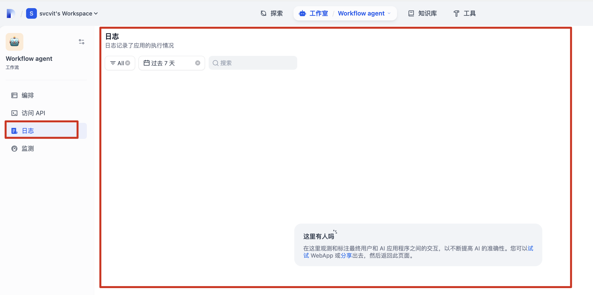

---

### Ron - 2025-05-09 10:22:11
我猜他说的会不会是这里的日志

---

### hjlarry - 2025-05-09 10:22:17
[捂脸]

---

### wxid_7da5db36yiad22 - 2025-05-09 10:23:33
[旺柴]搞一个开源项目 查看docker里面容器日志监控呗 搞一个页面

---

### Ron - 2025-05-09 10:27:23
http调用也会产生的

---

### wxid_9pgkq8ic90d521 - 2025-05-09 10:27:31
好的

---

### Ron - 2025-05-09 10:27:44
只有在编辑工作流的模式下，测试的时候不会产生

---

### Ron - 2025-05-09 10:28:04
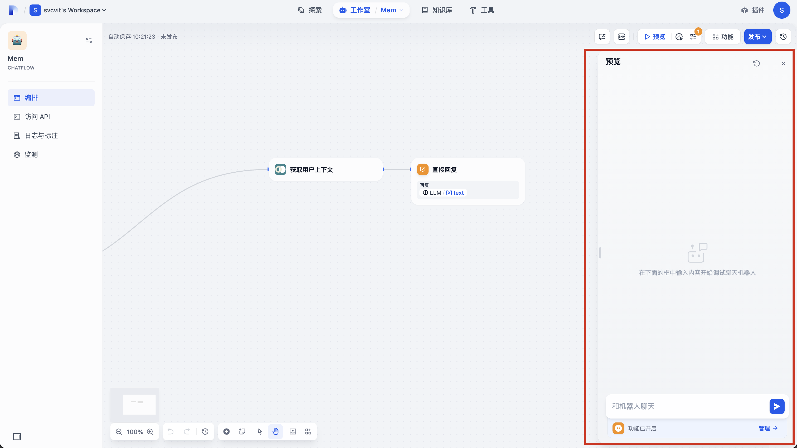

---

### wxid_7da5db36yiad22 - 2025-05-09 10:28:15
[旺柴]安装我的思路 是不是日志看起来更加容易呢

---

### wxid_7da5db36yiad22 - 2025-05-09 10:29:21
[旺柴]哈哈哈 我容器比较多

---

### wxid_7da5db36yiad22 - 2025-05-09 10:31:26
2分钟拉了一个 超快

---

### wxid_7da5db36yiad22 - 2025-05-09 10:31:39
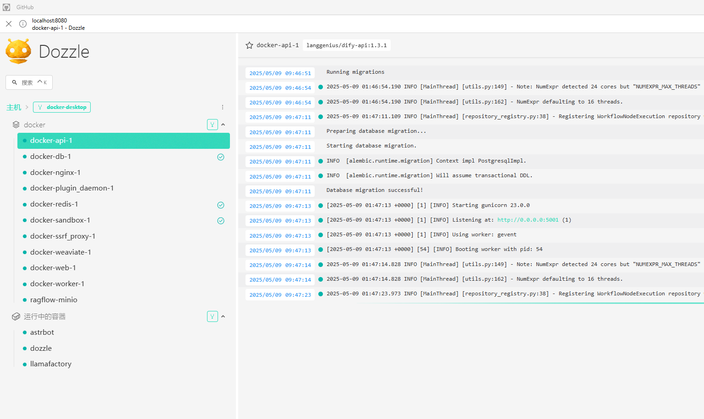

---

### wwzhouhui - 2025-05-09 10:42:57
我可以推荐一个给你

---

### wxid_7da5db36yiad22 - 2025-05-09 10:43:12
还有其他好用的？

---

### wxid_7da5db36yiad22 - 2025-05-09 10:43:20
感觉这个也可以了

---

### wwzhouhui - 2025-05-09 10:43:53
应该比你这个强

---

### wxid_7da5db36yiad22 - 2025-05-09 10:44:12
大神们 分享几个牛逼的dify工作流呗

---

### wwzhouhui - 2025-05-09 10:46:41
https://1panel.cn/docs/installation/online_installation/ 平台支持在线和离线安装

---

### wwzhouhui - 2025-05-09 10:46:54
这个工具应该比你工具好用

---

### wwzhouhui - 2025-05-09 10:47:25
不光监控容器，还有linux服务器都是可以的，最近还有mcp服务

---

### wxid_7da5db36yiad22 - 2025-05-09 10:47:49
[笑脸]好的 收藏 收藏

---

### wwzhouhui - 2025-05-09 10:48:39
后面也会有付费会员专享技术文章

---

### wwzhouhui - 2025-05-09 10:50:16
如果企业级一般用ki8s,如果规模小单个服务器推荐用1panel做服务器和容器管理

---

### wxid_7da5db36yiad22 - 2025-05-09 10:52:44
K8S目前没环境玩哦  哈哈哈

---

### wxid_9pgkq8ic90d521 - 2025-05-09 11:44:43
当前dify的api访问是http的，可以加证书变成https吗，具体在哪里配置？

---

### Ron - 2025-05-09 11:48:17
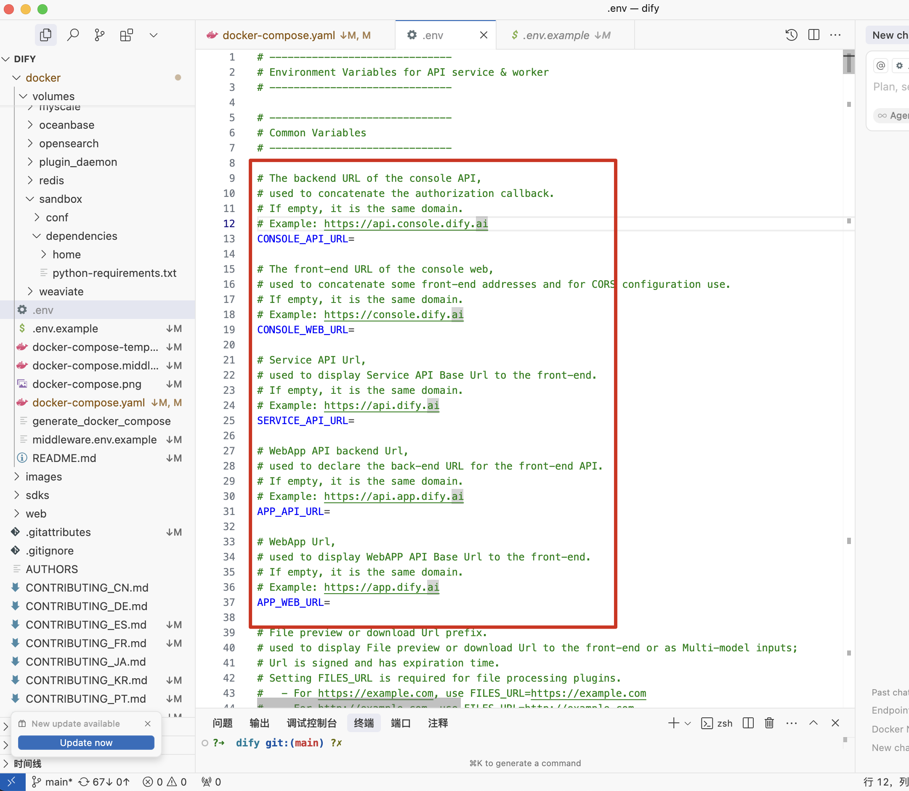

---

### Ron - 2025-05-09 11:48:35
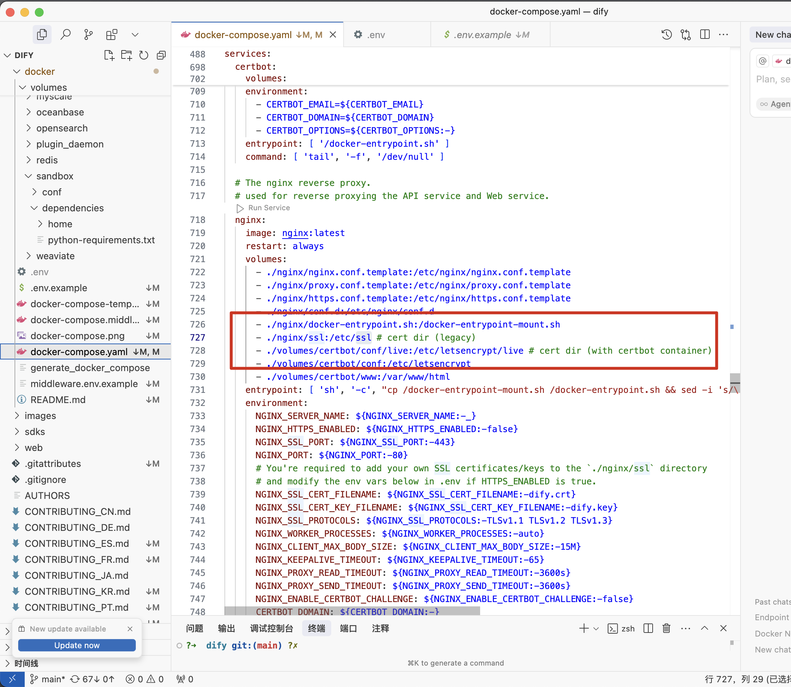

---

### Ron - 2025-05-09 11:48:39
看这俩地方

---

### wxid_pgye6v6ofbws22 - 2025-05-09 14:08:29
golang的代码报错缺失SDK：2025-05-09 11:48:51.296] [ERROR] [35c65ed4-c9e6-4baf-9347-3017a9af6a6c] @local_runtime/environment_python. go:363 failed to get the version of the plugin sdk: failed to find the version of the plugin sdk

---

### wxid_pgye6v6ofbws22 - 2025-05-09 14:09:20
这个报错会影响到正常使用吗？目前没发现问题

---

### hjlarry - 2025-05-09 14:12:40
没遇到过  我来看看

---

### hjlarry - 2025-05-09 14:16:30
这个不影响  它只检测一下plugin sdk的版本

---

### hjlarry - 2025-05-09 14:16:30
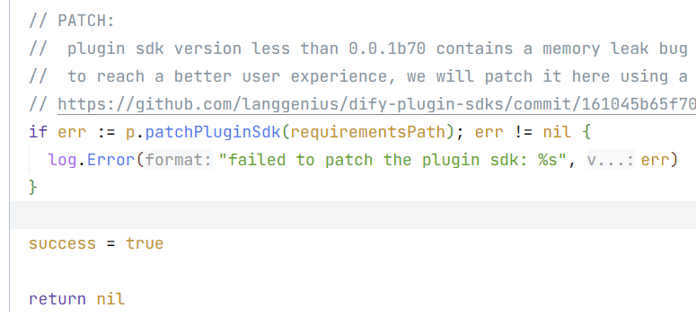

---

### hjlarry - 2025-05-09 14:16:42
升级以后昨天的问题好了？

---

### wxid_pgye6v6ofbws22 - 2025-05-09 14:16:59
后端升级完是可以了

---

### hjlarry - 2025-05-09 14:17:55
[捂脸]

---

### wxid_pgye6v6ofbws22 - 2025-05-10 11:19:43
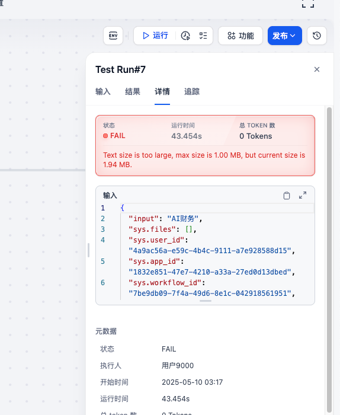

---

### wxid_pgye6v6ofbws22 - 2025-05-10 11:19:52
http插件限制了大小吗？

---

### wxid_pgye6v6ofbws22 - 2025-05-10 11:20:03
调用生图接口直接干报错了

---

### hjlarry - 2025-05-10 11:44:57
对的，环境变量里好像叫 http max body 吧

---

### wxid_dpsw5gcj3vg521 - 2025-05-10 17:24:51
老师们好，我有一个场景:低代码代码生成，主要是rag相关的dify流程设计还有知识库清洗做不好

---

### wxid_dpsw5gcj3vg521 - 2025-05-10 17:24:52

---

### wxid_dpsw5gcj3vg521 - 2025-05-10 17:24:56
大致的dify流程是这样的

---

### wxid_dpsw5gcj3vg521 - 2025-05-10 17:25:57
我的低代码用的是百度开源的amis那套

---

### Ron - 2025-05-10 17:26:05
你知识库的原始材料，发个看看？去掉一些敏感信息

---

### wxid_dpsw5gcj3vg521 - 2025-05-10 17:26:13
本身其实是已经ai有训练过的

---

### wxid_dpsw5gcj3vg521 - 2025-05-10 17:26:14
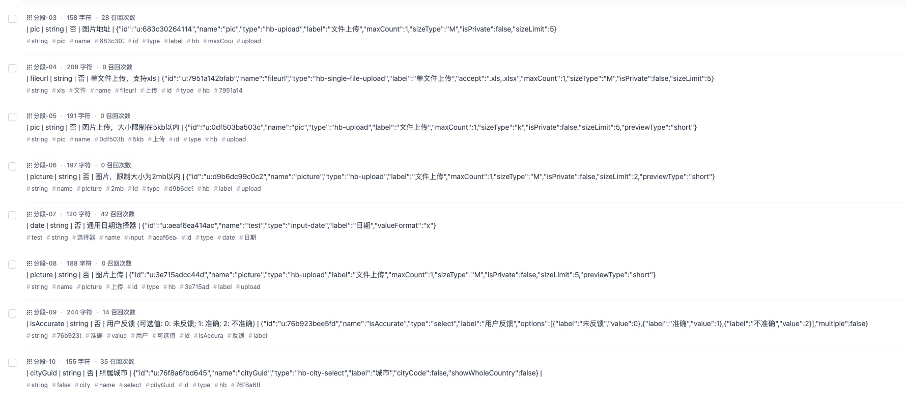

---

### wxid_dpsw5gcj3vg521 - 2025-05-10 17:26:23
知识库是一个个案例

---

### wxid_dpsw5gcj3vg521 - 2025-05-10 17:26:47
我的思路是用使用者已经上线的那些页面的json

---

### wxid_dpsw5gcj3vg521 - 2025-05-10 17:26:51
解析出字段

---

### wxid_dpsw5gcj3vg521 - 2025-05-10 17:26:58
作为案例库来源

---

### wxid_dpsw5gcj3vg521 - 2025-05-10 17:27:12
最终的强化版prompt我发一下示例

---

### wxid_dpsw5gcj3vg521 - 2025-05-10 17:28:21
<fields>
[{"name": "cityId","description":"城市id","type":"string"}]

# 示例
| 字段名 | 字段类型 | 是否必填 | 字段描述 | 标准答案 |
| cityGuid | string | 否 | 所属城市 | {"id":"u:76f8a6fbd645","name":"cityGuid","type":"hb-city-select","label":"城市","cityCode":false,"showWholeCountry":false} |
# 角色
你是一个百度低代码amis的局部代码生成器。你的职责是根据提供的fileds字段，优先参照示例中的标准答案来推导，为每一个字段生成amis json。

## 约束
- 优先参照示例中的返回，有时候会出现业务组件（非amis内置组件），需要从示例中推断用法
- 只输出生成的 JSON 数据，不需要输出解析过程，也不需要说明解释。
- 输出的数据需符合以下条件：
    1. 数据必须是一个数组。
    2. 根据字段中是否有枚举来调整生成内容。
    3. 输出的标题简洁、语义化，删除多余的描述。
    4. 如果值是有含义的英文字符串，则做合理的翻译。
- 补充一些常用业务的约束。

---

### wxid_dpsw5gcj3vg521 - 2025-05-10 17:28:46
这部分是接口文档的字段定义

---

### wxid_dpsw5gcj3vg521 - 2025-05-10 17:28:46

---

### wxid_dpsw5gcj3vg521 - 2025-05-10 17:29:06
这部分是从知识库里面获取到的案例

---

### wxid_dpsw5gcj3vg521 - 2025-05-10 17:29:07
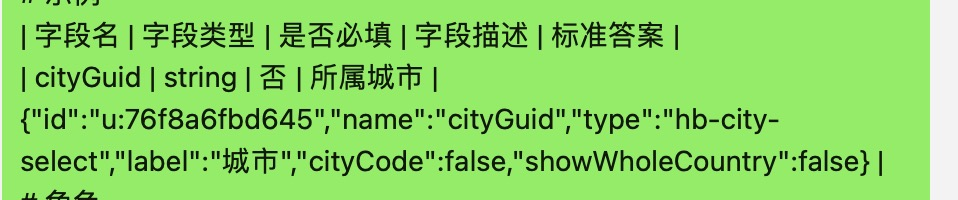

---

### wxid_dpsw5gcj3vg521 - 2025-05-10 17:29:18
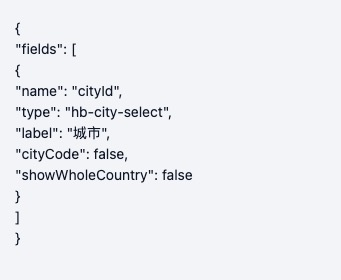

---

### wxid_dpsw5gcj3vg521 - 2025-05-10 17:29:27
结果也确实输出了我预期的内容

---

### wxid_dpsw5gcj3vg521 - 2025-05-10 17:29:48
我现在的问题是我线上解析出来的字段很多很多

---

### wxid_dpsw5gcj3vg521 - 2025-05-10 17:30:01
有的会内容超出知识块长度限制

---

### wxid_dpsw5gcj3vg521 - 2025-05-10 17:30:34
这是拿到的不是完整的示例，我给一个失败的案例最终prompt给你们看下

---

### Ron - 2025-05-10 17:33:24
我感觉，这个知识库的组织不太对，因为相似的都太高了，这种召回，感觉召回的内容都没有太大意义

---

### Ron - 2025-05-10 17:34:49
你这个流程，期待的输入，输出是什么？

---

### wxid_dpsw5gcj3vg521 - 2025-05-10 17:35:11
期待的输入是字段的声明，例如

---

### wxid_dpsw5gcj3vg521 - 2025-05-10 17:35:12
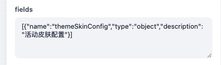

---

### wxid_dpsw5gcj3vg521 - 2025-05-10 17:35:20
这个字段声明来自于swagger或者yapi

---

### wxid_dpsw5gcj3vg521 - 2025-05-10 17:35:29
这类接口定义站点里

---

### wxid_dpsw5gcj3vg521 - 2025-05-10 17:36:39
输出是低代码的json，例如

---

### wxid_dpsw5gcj3vg521 - 2025-05-10 17:36:54
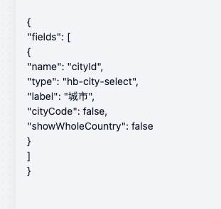

---

### wxid_dpsw5gcj3vg521 - 2025-05-10 17:37:04
fields里面就是低代码的schema

---

### wxid_dpsw5gcj3vg521 - 2025-05-10 17:37:43
其实amis本身是训练过的，所以就算不做知识库补充，也能准确度较高地生成

---

### wxid_dpsw5gcj3vg521 - 2025-05-10 17:37:49
就是不能生成本地扩充的业务组件

---

### wxid_pgye6v6ofbws22 - 2025-05-10 17:38:17
给个全称我检索一下

---

### wxid_dpsw5gcj3vg521 - 2025-05-10 17:39:36
还有就是不能做类似业务习惯的配置，例如amis配置日期输入默认就是以秒为单位的值

---

### wxid_dpsw5gcj3vg521 - 2025-05-10 17:39:36
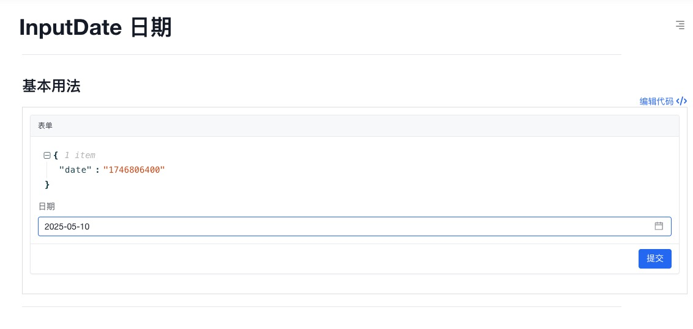

---

### wxid_dpsw5gcj3vg521 - 2025-05-10 17:39:57
咋们习惯用毫秒的

---

### wxid_dpsw5gcj3vg521 - 2025-05-10 17:40:10
https://aisuda.bce.baidu.com/amis/zh-CN/components/form/input-date

---

### wxid_dpsw5gcj3vg521 - 2025-05-10 17:40:30
所以配置案例实际上是希望影响生成出来的效果

---

### hjlarry - 2025-05-10 17:44:19
HTTP_REQUEST_NODE_MAX_TEXT_SIZE=1048576

---

### wxid_dpsw5gcj3vg521 - 2025-05-10 17:45:28
例如ai默认生成的是{
        "type": "input-date",
        "name": "date",
        "label": "日期"
      }

---

### wxid_dpsw5gcj3vg521 - 2025-05-10 17:45:39
我们希望是{
        "type": "input-date",
        "name": "date",
        "label": "日期",
        "format": "x"
      }

---

### wxid_dpsw5gcj3vg521 - 2025-05-10 17:46:45
我觉得要初始化很多示例会很麻烦，所以才想说把团队已经上线的那个页面schema作为素材来用

---

### wxid_dpsw5gcj3vg521 - 2025-05-10 17:47:19
因为我们写了100来张页面，所以初始化理论上有1000+的字段案例

---

### Ron - 2025-05-10 17:50:10
我大概理解你的意思和目的了

---

### Ron - 2025-05-10 17:50:37
你这 1000 多个字段，应该有很多类似，或者重复的吧

---

### wxid_dpsw5gcj3vg521 - 2025-05-10 17:50:46
对

---

### Ron - 2025-05-10 17:51:23
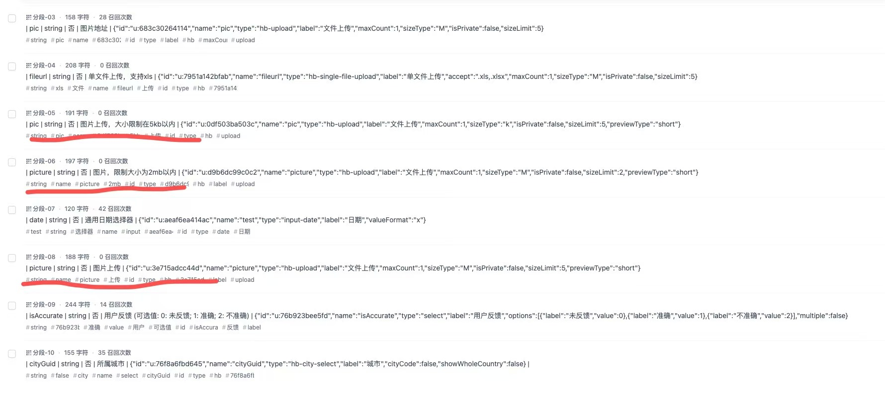

---

### wxid_dpsw5gcj3vg521 - 2025-05-10 17:51:54
且有的是意义不明，因为比如存在出现其他字段的显影控制，"visibleOn": "${items.length > 1}",

---

### Ron - 2025-05-10 17:54:18
你这里，这种召回，这肯定都很难召对，我觉得你们可以整理一下，你们自己调整过的组建，形成一个文档，假设 30 个？不要重复。然后作为提示词的上下文，ai 输出，可能比用知识库要好。

---

### Ron - 2025-05-10 17:54:52
你看上面 3 个，基本都是重复的

---

### wxid_dpsw5gcj3vg521 - 2025-05-10 17:55:05
有不同用法

---

### wxid_dpsw5gcj3vg521 - 2025-05-10 17:55:10
同一个组件不同用法

---

### wxid_dpsw5gcj3vg521 - 2025-05-10 17:57:13
有些是可以看出来的

---

### wxid_dpsw5gcj3vg521 - 2025-05-10 17:57:44
这个其实引申出来也可以做用户描述转低代码的

---

### wxid_dpsw5gcj3vg521 - 2025-05-10 17:58:09
描述的越清楚，理论上就可以从知识库里面找到最合适的案例，所以知识库得维护好

---

### wxid_dpsw5gcj3vg521 - 2025-05-10 17:58:13
且多

---

### hjlarry - 2025-05-10 18:00:14
你的知识库存的本质上是一个个example？  那你是觉得现在没有召回到合适的example还是召回了模型没按示例生成？

---

### Ron - 2025-05-10 18:00:47
如果这样，你的知识库更合适是一个描述案例，对应一个最佳输出的 json

---

### wxid_dpsw5gcj3vg521 - 2025-05-10 18:01:45
合适的example能带来合适的输出

---

### wxid_dpsw5gcj3vg521 - 2025-05-10 18:02:06
一个是线上的字段案例有时候会超出dify的知识片段长度限制

---

### wxid_dpsw5gcj3vg521 - 2025-05-10 18:02:29
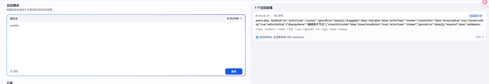

---

### wxid_dpsw5gcj3vg521 - 2025-05-10 18:02:31
比如说这个

---

### wxid_dpsw5gcj3vg521 - 2025-05-10 18:02:40
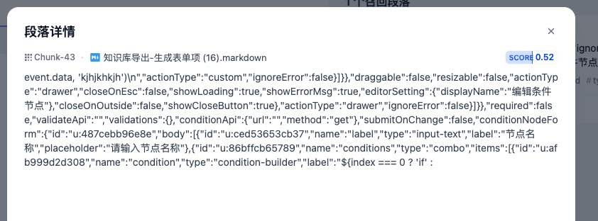

---

### wxid_dpsw5gcj3vg521 - 2025-05-10 18:02:43
段落是不完整的

---

### wxid_dpsw5gcj3vg521 - 2025-05-10 18:03:18
一个是线上的案例字段单独抽出来会有迷惑的地方

---

### wxid_dpsw5gcj3vg521 - 2025-05-10 18:04:01
比如说visibleOn: "${其他元素定义的字段}"

---

### wxid_dpsw5gcj3vg521 - 2025-05-10 18:04:25
需要加上其他元素才能体现出visibleOn的用法

---

### wxid_dpsw5gcj3vg521 - 2025-05-10 18:04:35
但是我这边逻辑是一个字段一个案例

---

### Ron - 2025-05-10 18:05:47
哈哈哈，我知道了，你现在适合用一个高级模型，长上下文，把你现在 1000 个组建，丢进去，然后写一两个示例，让 ai 整理，输出对应内容，例如 100 个

---

### wxid_dpsw5gcj3vg521 - 2025-05-10 18:08:15
用ai来整理1000个案例，输出有效的配置案例？

---

### Ron - 2025-05-10 18:08:56
我感觉先看看整理效果

---

### Ron - 2025-05-10 18:09:04
开始不用这么多

---

### wxid_dpsw5gcj3vg521 - 2025-05-10 18:10:45
我字段案例其实已经导出为markdown文件了，直接放进去就可以了

---

### wxid_dpsw5gcj3vg521 - 2025-05-10 18:11:38

---

### wxid_dpsw5gcj3vg521 - 2025-05-10 18:11:38
类似这样的

---

### wxid_dpsw5gcj3vg521 - 2025-05-10 18:13:03
我现在思考的是在对combo、input-table这类有子元素的字段做解析，把里面的字段抽出来作为新的案例

---

### wxid_dpsw5gcj3vg521 - 2025-05-10 18:13:34
来减少单行字段的内容长度，减少知识库切割为片段不完整的概率

---

### wxid_dpsw5gcj3vg521 - 2025-05-10 18:15:13
还有就是对描述进行逆推，因为很多接口字段说明其实不能体现出细节功能点

---

### wxid_dpsw5gcj3vg521 - 2025-05-10 18:15:55
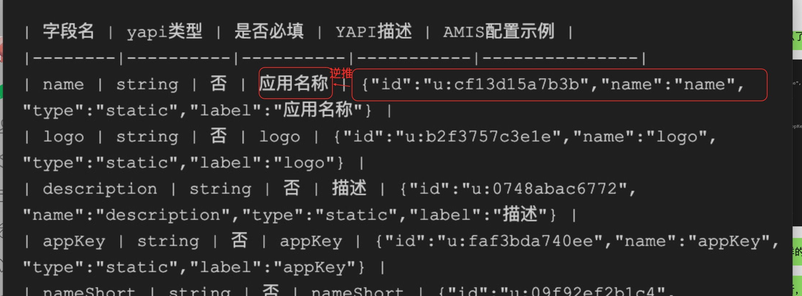

---

### wxid_dpsw5gcj3vg521 - 2025-05-10 18:16:01
用ai来逆推这个

---

### wxid_dpsw5gcj3vg521 - 2025-05-10 18:17:02
先去吃饭啦，辛苦各位老师抽空帮我看看

---

### Ron - 2025-05-10 18:23:17
okok，你回头发我个 100 行，给我两三个输入和输出的例子，输入是自然语言加上你现在输入的组合，输出是你的组件 json

---

### wxid_pgye6v6ofbws22 - 2025-05-11 09:13:28
flowgram和dify比起来有优势吗？

---

### wwzhouhui - 2025-05-11 09:15:15
flowgram是字节刚推出的开源项目，就是 目前用的coze 提供的工作流，目前还没深入研究 

---

### wwzhouhui - 2025-05-11 09:27:25
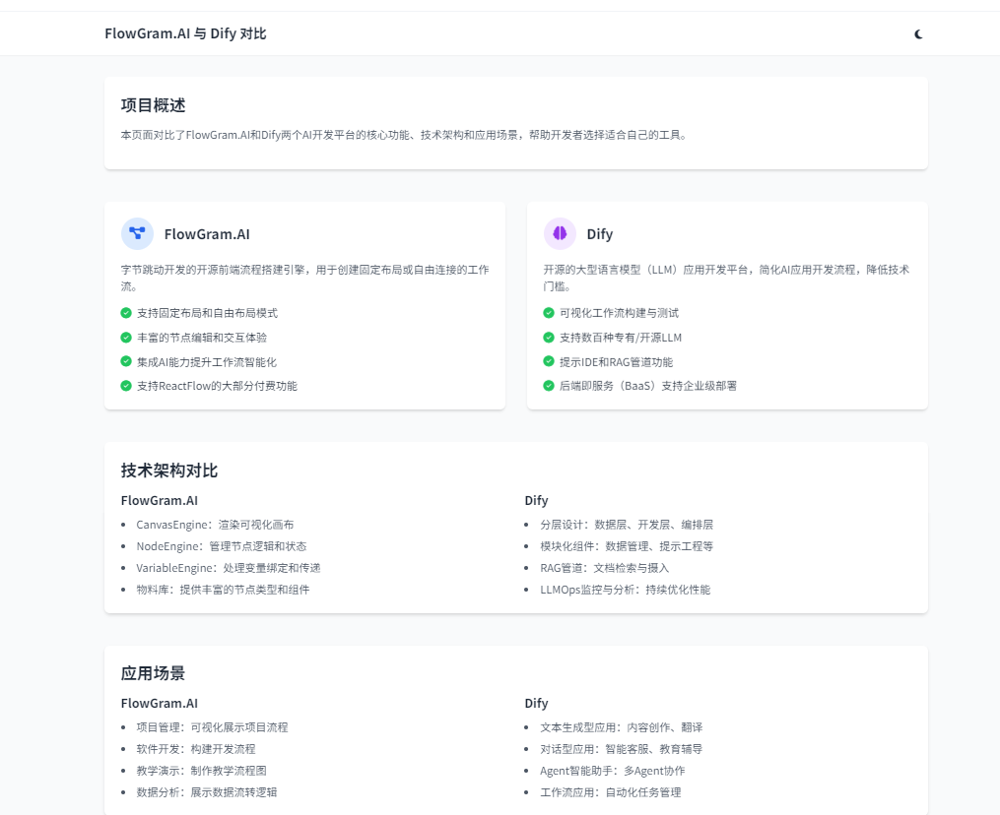

---

### wxid_twh09qctjv7822 - 2025-05-11 09:29:09
flowgram 是不是只是一个前端画布啊，能直接用吗？

---

### wwzhouhui - 2025-05-11 09:30:38
它开源到了 可以在自己电脑上部署，我一会研究一下，有消息发给大家

---

### wxid_pgye6v6ofbws22 - 2025-05-11 09:30:42
部署一个玩玩，感觉比dify抖音插件多

---

### wwzhouhui - 2025-05-11 09:31:31
但是有一点 你要知道 他的东西开源 很多模型后端是要字节自己东西，可能会有点贵 

---

### wwzhouhui - 2025-05-11 09:32:01
已就是说 它是开源了，但是 模型  TTS 还有插件是 它自己指定的模型和相关工具 

---

### wwzhouhui - 2025-05-11 09:32:33
我之前弄过他 火山引擎上的几个开源项目，效果是挺不错，但是需要他们家的模型。

---

### wwzhouhui - 2025-05-11 10:29:44
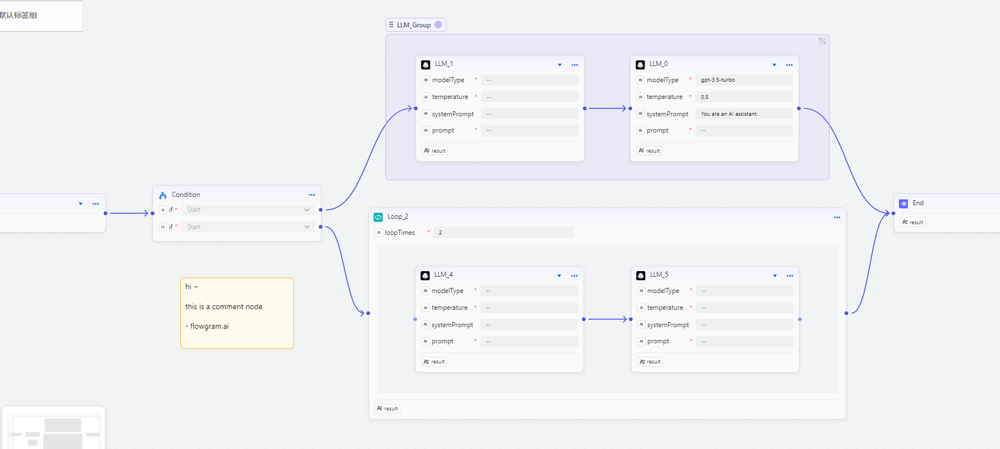

---

### wwzhouhui - 2025-05-11 10:29:44
跑出来了，目前功能还比较弱 

---

### wwzhouhui - 2025-05-11 10:39:32
感兴趣的可以看一下

---

### wxid_pgye6v6ofbws22 - 2025-05-11 10:46:39
啥也没有

---

### wxid_pgye6v6ofbws22 - 2025-05-11 10:47:00

---

### wxid_pgye6v6ofbws22 - 2025-05-11 10:47:20
就分支 llm 和loop没了

---

### hjlarry - 2025-05-11 10:47:45
那倒也不全是 reactflow，多了两节点[旺柴]

---

### wxid_pgye6v6ofbws22 - 2025-05-11 10:51:00
暂时想不出来这玩意能干嘛[捂脸]

---

### wxid_pgye6v6ofbws22 - 2025-05-11 10:51:14
不知道后面会不会做成dify那样

---

### wxid_pgye6v6ofbws22 - 2025-05-11 10:51:29
不过这项目现在后端都没

---

### hjlarry - 2025-05-11 10:53:31
这项目就是把coze的前端画布部分开源出来了吧    方便其他想做画布类应用的开发者

---

### wxid_pgye6v6ofbws22 - 2025-05-11 10:56:37
感觉是这样

---

### godspeed6633 - 2025-05-11 11:44:06
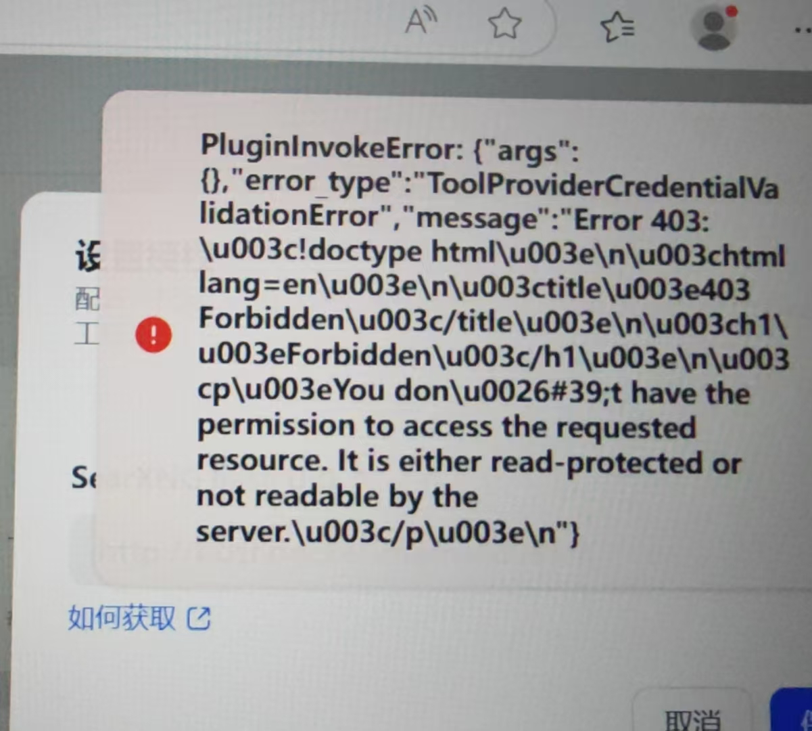

---

### godspeed6633 - 2025-05-11 11:44:15
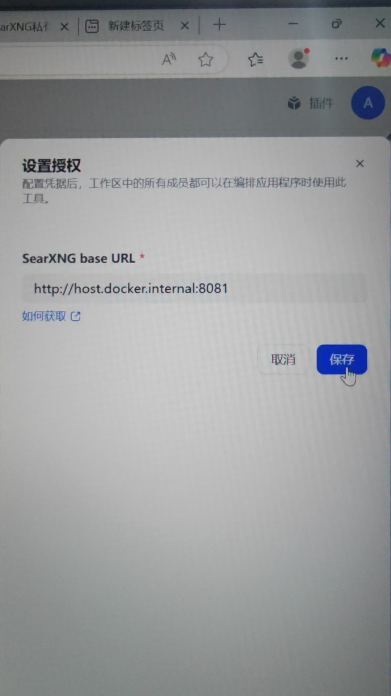

---

### godspeed6633 - 2025-05-11 11:44:41

---

### godspeed6633 - 2025-05-11 11:45:03
求助  这个工具怎么添加？ 按DIFY操作手册 报错

---

### wwzhouhui - 2025-05-11 11:45:37
换成 局域网IP试一试 

---

### wwzhouhui - 2025-05-11 11:45:46
另外这插件需要 科学上网 

---

### wwzhouhui - 2025-05-11 11:46:57
https://mp.weixin.qq.com/s/49psBbYxd6oVdu6Q--hIbg

---

### wwzhouhui - 2025-05-11 11:47:14
我之前在0.15.3 版本测试过的 

---

### hjlarry - 2025-05-11 11:50:04
 0.15 版本，我把它的配置放在项目里了，所以直接启动就可以，但是 1.0 以后得自己启动了，需要自己设置了

---

### godspeed6633 - 2025-05-11 11:52:50
非常感谢

---

### wxid_pgye6v6ofbws22 - 2025-05-11 14:35:36
chatflow能像coze一样分段输出多个消息吗

---

### hjlarry - 2025-05-11 14:48:04
没怎么用 coze，什么样就算是分段输出

---

### wxid_pgye6v6ofbws22 - 2025-05-11 14:52:57
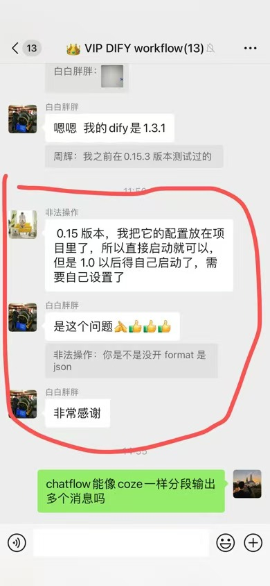

---

### wxid_pgye6v6ofbws22 - 2025-05-11 14:53:28
就像这样 回复不止一个

---

### hjlarry - 2025-05-11 15:04:27
这应该实现不了，它总是会把一个 chatflow 执行完

---

### wxid_pgye6v6ofbws22 - 2025-05-11 17:28:35
@RON 微信群聊二维码只能7天，你是怎么维护的？真手动替换吗 还是用了活码

---

### Ron - 2025-05-11 18:05:16
我是纯手工，本来也要维护的

---

### wwzhouhui - 2025-05-11 22:35:06
https://github.com/xxnuo/serverless-qrcode-hub   这个项目可以实现微信群聊二维码自动生成

---

### wxid_pgye6v6ofbws22 - 2025-05-11 23:57:33
🐮

---

### wwzhouhui - 2025-05-12 09:32:49
整理目前ron开源和我的dify工作流，放到百度网盘里面，需要的同学自取

---

### Ron - 2025-05-12 09:47:19
[ThumbsUp][ThumbsUp]

---

### ani424094144 - 2025-05-12 09:57:03
[ThumbsUp][ThumbsUp]

---

### wxid_twh09qctjv7822 - 2025-05-12 09:58:05
[强][强]

---

### godspeed6633 - 2025-05-12 10:03:22
非常好 正在体验

---

### wxid_pgye6v6ofbws22 - 2025-05-12 10:07:37
[强][强]

---

### godspeed6633 - 2025-05-12 10:07:55
ppt生成助手，依赖的容器没标识[流泪]

---

### godspeed6633 - 2025-05-12 10:07:56
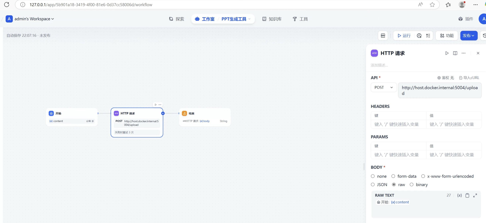

---

### wxid_pgye6v6ofbws22 - 2025-05-12 10:13:04
这是本地服务

---

### dezhi-2008 - 2025-05-12 17:40:13
请问dify1.2以上的版本可以多agent协作吗

---

### hjlarry - 2025-05-12 17:40:58
可以设置多个agent节点  但是工作流都是向前  不能往回走  和multi agent有区别

---

### dezhi-2008 - 2025-05-12 17:41:18
哦哦好的，谢谢

---

### wxid_9pgkq8ic90d521 - 2025-05-12 17:42:49

---

### wxid_9pgkq8ic90d521 - 2025-05-12 17:43:29
duckduckgo这里报错，请问是什么原因呢？

---

### hjlarry - 2025-05-12 17:44:09
应该是这个插件的bug

---

